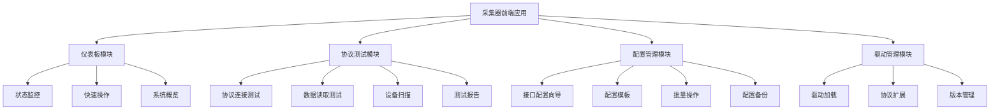

# 采集器前端优化设计文档

## 概述

本设计文档详细描述了ProDB采集器前端的优化方案。基于现有的Preact + 原生JavaScript技术栈，我们将重新设计用户界面，创建一个简洁、轻量、功能强大的采集器管理和测试工具。设计重点关注临时管理功能、协议测试能力和多驱动支持。

## 架构设计

### 技术栈保持
- **前端框架**: Preact (轻量级React替代)
- **模块系统**: ES6 Modules + CDN导入
- **样式**: 原生CSS + CSS变量
- **状态管理**: Preact Hooks
- **HTTP客户端**: 原生Fetch API
- **构建**: 无构建工具，直接运行

### 整体架构



## 组件和接口设计

### 1. 优化后的应用结构

#### 新的文件组织结构
```
collector/frontend/
├── index.html              # 主页面
├── app.js                  # 应用入口
├── styles/
│   ├── main.css           # 主样式文件
│   ├── components.css     # 组件样式
│   └── themes.css         # 主题样式
├── components/
│   ├── Layout.js          # 布局组件
│   ├── StatusIndicator.js # 状态指示器
│   ├── QuickActions.js    # 快速操作
│   ├── ProtocolTester.js  # 协议测试器
│   └── ConfigWizard.js    # 配置向导
├── pages/
│   ├── DashboardPage.js   # 优化后的仪表板
│   ├── TestingPage.js     # 协议测试页面
│   ├── ConfigPage.js      # 配置管理页面
│   └── DriversPage.js     # 驱动管理页面
├── services/
│   ├── api.js             # API服务
│   ├── protocols.js       # 协议服务
│   └── drivers.js         # 驱动服务
└── utils/
    ├── validation.js      # 验证工具
    └── helpers.js         # 辅助函数
```

### 2. 简化的仪表板设计

#### 仪表板数据模型
```javascript
// 系统状态接口
export interface CollectorStatus {
  id: string;
  name: string;
  status: 'running' | 'stopped' | 'error';
  uptime: number;
  dataPoints: number;
  errorCount: number;
  lastUpdate: string;
  memoryUsage: number;
  cpuUsage: number;
}

// 接口状态接口
export interface InterfaceStatus {
  id: string;
  name: string;
  type: string;
  status: 'connected' | 'disconnected' | 'error' | 'testing';
  dataRate: number;
  errorRate: number;
  lastData: string;
  config: any;
  quickActions: string[];
}
```

#### 简化的仪表板组件
```javascript
// DashboardPage.js - 优化版本
import { html } from 'https://esm.sh/htm/preact';
import { useState, useEffect } from 'https://esm.sh/preact/hooks';
import StatusIndicator from '../components/StatusIndicator.js';
import QuickActions from '../components/QuickActions.js';

const DashboardPage = () => {
    const [systemStatus, setSystemStatus] = useState(null);
    const [interfaces, setInterfaces] = useState([]);
    const [refreshInterval, setRefreshInterval] = useState(5000);

    // 自动刷新逻辑
    useEffect(() => {
        const fetchData = async () => {
            try {
                const [statusRes, interfacesRes] = await Promise.all([
                    fetch('/api/v1/status'),
                    fetch('/api/v1/interfaces')
                ]);
                
                setSystemStatus(await statusRes.json());
                setInterfaces(await interfacesRes.json());
            } catch (error) {
                console.error('Failed to fetch data:', error);
            }
        };

        fetchData();
        const interval = setInterval(fetchData, refreshInterval);
        return () => clearInterval(interval);
    }, [refreshInterval]);

    return html`
        <div class="dashboard-container">
            <!-- 系统概览卡片 -->
            <div class="system-overview-card">
                <h2>系统状态</h2>
                ${systemStatus && html`
                    <div class="status-grid">
                        <${StatusIndicator} 
                            label="运行状态" 
                            value=${systemStatus.status} 
                            type="status" 
                        />
                        <${StatusIndicator} 
                            label="运行时间" 
                            value=${formatUptime(systemStatus.uptime)} 
                            type="info" 
                        />
                        <${StatusIndicator} 
                            label="数据点数" 
                            value=${systemStatus.dataPoints} 
                            type="counter" 
                        />
                        <${StatusIndicator} 
                            label="错误数量" 
                            value=${systemStatus.errorCount} 
                            type="error" 
                        />
                    </div>
                `}
            </div>

            <!-- 接口状态卡片 -->
            <div class="interfaces-grid">
                ${interfaces.map(iface => html`
                    <div class="interface-card ${iface.status}" key=${iface.id}>
                        <div class="card-header">
                            <h3>${iface.name}</h3>
                            <${StatusIndicator} 
                                value=${iface.status} 
                                type="status" 
                                size="small" 
                            />
                        </div>
                        <div class="card-body">
                            <div class="interface-info">
                                <span class="protocol-type">${iface.type}</span>
                                <span class="data-rate">${iface.dataRate} pts/s</span>
                            </div>
                            <div class="last-update">
                                最后更新: ${formatTime(iface.lastData)}
                            </div>
                        </div>
                        <div class="card-actions">
                            <${QuickActions} 
                                interfaceId=${iface.id} 
                                status=${iface.status}
                                actions=${iface.quickActions}
                            />
                        </div>
                    </div>
                `)}
                
                <!-- 添加新接口卡片 -->
                <div class="add-interface-card" onClick=${() => navigateTo('/config/new')}>
                    <div class="add-content">
                        <span class="add-icon">+</span>
                        <p>添加接口</p>
                    </div>
                </div>
            </div>

            <!-- 快速测试入口 -->
            <div class="quick-test-section">
                <button class="test-button" onClick=${() => navigateTo('/testing')}>
                    🔧 协议测试工具
                </button>
                <button class="drivers-button" onClick=${() => navigateTo('/drivers')}>
                    📦 驱动管理
                </button>
            </div>
        </div>
    `;
};
```

### 3. 协议测试模块设计

#### 协议测试数据模型
```javascript
// 支持的协议类型
export const SUPPORTED_PROTOCOLS = {
    'OPC_UA': {
        name: 'OPC UA',
        params: ['endpoint', 'securityPolicy', 'username', 'password'],
        testMethods: ['connect', 'browse', 'read', 'subscribe']
    },
    'OPC_DA': {
        name: 'OPC DA',
        params: ['server', 'clsid', 'username', 'password'],
        testMethods: ['connect', 'browse', 'read']
    },
    'MODBUS_TCP': {
        name: 'Modbus TCP',
        params: ['host', 'port', 'slaveId', 'timeout'],
        testMethods: ['connect', 'readCoils', 'readHolding', 'readInput']
    },
    'MODBUS_RTU': {
        name: 'Modbus RTU',
        params: ['port', 'baudRate', 'dataBits', 'stopBits', 'parity', 'slaveId'],
        testMethods: ['connect', 'readCoils', 'readHolding', 'readInput']
    },
    'MQTT': {
        name: 'MQTT',
        params: ['broker', 'port', 'clientId', 'username', 'password', 'topic'],
        testMethods: ['connect', 'subscribe', 'publish']
    },
    'ETHERNET_IP': {
        name: 'Ethernet/IP',
        params: ['host', 'port', 'slot', 'timeout'],
        testMethods: ['connect', 'readTag', 'writeTag']
    }
};

// 测试结果接口
export interface TestResult {
    protocol: string;
    testType: string;
    success: boolean;
    duration: number;
    data?: any;
    error?: string;
    timestamp: string;
}

// 设备扫描结果
export interface DeviceScanResult {
    ip: string;
    hostname?: string;
    protocols: string[];
    services: ServiceInfo[];
    responseTime: number;
}
```

#### 协议测试组件
```javascript
// TestingPage.js
import { html } from 'https://esm.sh/htm/preact';
import { useState } from 'https://esm.sh/preact/hooks';
import ProtocolTester from '../components/ProtocolTester.js';

const TestingPage = () => {
    const [selectedProtocol, setSelectedProtocol] = useState('OPC_UA');
    const [testMode, setTestMode] = useState('single'); // 'single' | 'scan' | 'batch'
    const [testResults, setTestResults] = useState([]);

    return html`
        <div class="testing-container">
            <div class="testing-header">
                <h1>协议测试工具</h1>
                <div class="test-mode-selector">
                    <button 
                        class=${testMode === 'single' ? 'active' : ''} 
                        onClick=${() => setTestMode('single')}
                    >
                        单点测试
                    </button>
                    <button 
                        class=${testMode === 'scan' ? 'active' : ''} 
                        onClick=${() => setTestMode('scan')}
                    >
                        设备扫描
                    </button>
                    <button 
                        class=${testMode === 'batch' ? 'active' : ''} 
                        onClick=${() => setTestMode('batch')}
                    >
                        批量测试
                    </button>
                </div>
            </div>

            <div class="testing-content">
                ${testMode === 'single' && html`
                    <${ProtocolTester} 
                        protocol=${selectedProtocol}
                        onProtocolChange=${setSelectedProtocol}
                        onTestComplete=${(result) => setTestResults([...testResults, result])}
                    />
                `}
                
                ${testMode === 'scan' && html`
                    <${DeviceScanner} 
                        onScanComplete=${(devices) => console.log('Scanned devices:', devices)}
                    />
                `}
                
                ${testMode === 'batch' && html`
                    <${BatchTester} 
                        onBatchComplete=${(results) => setTestResults([...testResults, ...results])}
                    />
                `}
            </div>

            <!-- 测试结果展示 -->
            <div class="test-results">
                <h3>测试结果</h3>
                <div class="results-list">
                    ${testResults.map((result, index) => html`
                        <div class="result-item ${result.success ? 'success' : 'error'}" key=${index}>
                            <div class="result-header">
                                <span class="protocol">${result.protocol}</span>
                                <span class="test-type">${result.testType}</span>
                                <span class="duration">${result.duration}ms</span>
                            </div>
                            <div class="result-content">
                                ${result.success 
                                    ? html`<pre>${JSON.stringify(result.data, null, 2)}</pre>`
                                    : html`<span class="error">${result.error}</span>`
                                }
                            </div>
                        </div>
                    `)}
                </div>
            </div>
        </div>
    `;
};
```

### 4. 配置向导设计

#### 配置向导组件
```javascript
// ConfigWizard.js
import { html } from 'https://esm.sh/htm/preact';
import { useState } from 'https://esm.sh/preact/hooks';

const ConfigWizard = ({ onComplete, initialData = null }) => {
    const [currentStep, setCurrentStep] = useState(0);
    const [config, setConfig] = useState(initialData || {});
    const [validationErrors, setValidationErrors] = useState({});

    const steps = [
        { title: '选择协议', component: ProtocolSelection },
        { title: '基本配置', component: BasicConfig },
        { title: '高级设置', component: AdvancedConfig },
        { title: '测试连接', component: ConnectionTest },
        { title: '完成配置', component: ConfigSummary }
    ];

    const nextStep = () => {
        if (validateCurrentStep()) {
            setCurrentStep(Math.min(currentStep + 1, steps.length - 1));
        }
    };

    const prevStep = () => {
        setCurrentStep(Math.max(currentStep - 1, 0));
    };

    const validateCurrentStep = () => {
        // 实现步骤验证逻辑
        return true;
    };

    return html`
        <div class="config-wizard">
            <!-- 步骤指示器 -->
            <div class="wizard-steps">
                ${steps.map((step, index) => html`
                    <div class="step ${index === currentStep ? 'active' : ''} ${index < currentStep ? 'completed' : ''}">
                        <div class="step-number">${index + 1}</div>
                        <div class="step-title">${step.title}</div>
                    </div>
                `)}
            </div>

            <!-- 当前步骤内容 -->
            <div class="wizard-content">
                <${steps[currentStep].component} 
                    config=${config}
                    onConfigChange=${setConfig}
                    errors=${validationErrors}
                />
            </div>

            <!-- 导航按钮 -->
            <div class="wizard-navigation">
                <button 
                    onClick=${prevStep} 
                    disabled=${currentStep === 0}
                    class="btn-secondary"
                >
                    上一步
                </button>
                <button 
                    onClick=${currentStep === steps.length - 1 ? () => onComplete(config) : nextStep}
                    class="btn-primary"
                >
                    ${currentStep === steps.length - 1 ? '完成' : '下一步'}
                </button>
            </div>
        </div>
    `;
};
```

### 5. 驱动管理模块

#### 驱动管理数据模型
```javascript
// 驱动信息接口
export interface DriverInfo {
    id: string;
    name: string;
    version: string;
    protocol: string;
    status: 'loaded' | 'unloaded' | 'error';
    description: string;
    author: string;
    supportedFeatures: string[];
    configSchema: any;
    lastUpdated: string;
    filePath: string;
}

// 驱动加载结果
export interface DriverLoadResult {
    success: boolean;
    driverId: string;
    error?: string;
    warnings?: string[];
}
```

#### 驱动管理组件
```javascript
// DriversPage.js
const DriversPage = () => {
    const [drivers, setDrivers] = useState([]);
    const [availableDrivers, setAvailableDrivers] = useState([]);
    const [showInstallDialog, setShowInstallDialog] = useState(false);

    return html`
        <div class="drivers-container">
            <div class="drivers-header">
                <h1>驱动管理</h1>
                <div class="drivers-actions">
                    <button onClick=${() => setShowInstallDialog(true)}>
                        安装驱动
                    </button>
                    <button onClick=${scanForDrivers}>
                        扫描驱动
                    </button>
                </div>
            </div>

            <!-- 已加载驱动 -->
            <div class="loaded-drivers">
                <h2>已加载驱动</h2>
                <div class="drivers-grid">
                    ${drivers.map(driver => html`
                        <div class="driver-card ${driver.status}" key=${driver.id}>
                            <div class="driver-header">
                                <h3>${driver.name}</h3>
                                <span class="version">v${driver.version}</span>
                            </div>
                            <div class="driver-info">
                                <p class="protocol">${driver.protocol}</p>
                                <p class="description">${driver.description}</p>
                            </div>
                            <div class="driver-actions">
                                <button onClick=${() => toggleDriver(driver.id)}>
                                    ${driver.status === 'loaded' ? '卸载' : '加载'}
                                </button>
                                <button onClick=${() => configureDriver(driver.id)}>
                                    配置
                                </button>
                            </div>
                        </div>
                    `)}
                </div>
            </div>

            <!-- 可用驱动 -->
            <div class="available-drivers">
                <h2>可用驱动</h2>
                <div class="drivers-list">
                    ${availableDrivers.map(driver => html`
                        <div class="driver-item" key=${driver.id}>
                            <div class="driver-info">
                                <h4>${driver.name}</h4>
                                <p>${driver.description}</p>
                            </div>
                            <button onClick=${() => installDriver(driver.id)}>
                                安装
                            </button>
                        </div>
                    `)}
                </div>
            </div>
        </div>
    `;
};
```

## 样式设计

### 1. 现代化CSS设计系统

```css
/* styles/main.css - 设计系统 */
:root {
    /* 颜色系统 */
    --color-primary: #2563eb;
    --color-primary-hover: #1d4ed8;
    --color-success: #10b981;
    --color-warning: #f59e0b;
    --color-error: #ef4444;
    --color-info: #06b6d4;
    
    /* 背景色 */
    --bg-primary: #0f172a;
    --bg-secondary: #1e293b;
    --bg-tertiary: #334155;
    --bg-card: #1e293b;
    --bg-hover: #334155;
    
    /* 文字颜色 */
    --text-primary: #f8fafc;
    --text-secondary: #cbd5e1;
    --text-muted: #64748b;
    
    /* 边框和阴影 */
    --border-color: #334155;
    --border-radius: 8px;
    --shadow-sm: 0 1px 2px 0 rgb(0 0 0 / 0.05);
    --shadow-md: 0 4px 6px -1px rgb(0 0 0 / 0.1);
    --shadow-lg: 0 10px 15px -3px rgb(0 0 0 / 0.1);
    
    /* 间距系统 */
    --space-1: 0.25rem;
    --space-2: 0.5rem;
    --space-3: 0.75rem;
    --space-4: 1rem;
    --space-6: 1.5rem;
    --space-8: 2rem;
    
    /* 字体 */
    --font-family: 'Inter', -apple-system, BlinkMacSystemFont, sans-serif;
    --font-size-sm: 0.875rem;
    --font-size-base: 1rem;
    --font-size-lg: 1.125rem;
    --font-size-xl: 1.25rem;
}

/* 基础样式重置 */
* {
    box-sizing: border-box;
    margin: 0;
    padding: 0;
}

body {
    font-family: var(--font-family);
    background-color: var(--bg-primary);
    color: var(--text-primary);
    line-height: 1.6;
}

/* 布局组件 */
.layout {
    display: flex;
    min-height: 100vh;
}

.sidebar {
    width: 240px;
    background-color: var(--bg-secondary);
    border-right: 1px solid var(--border-color);
    padding: var(--space-6);
}

.main-content {
    flex: 1;
    padding: var(--space-8);
    overflow-y: auto;
}

/* 卡片组件 */
.card {
    background-color: var(--bg-card);
    border: 1px solid var(--border-color);
    border-radius: var(--border-radius);
    padding: var(--space-6);
    box-shadow: var(--shadow-sm);
    transition: all 0.2s ease;
}

.card:hover {
    box-shadow: var(--shadow-md);
    border-color: var(--color-primary);
}

/* 按钮组件 */
.btn {
    display: inline-flex;
    align-items: center;
    justify-content: center;
    padding: var(--space-2) var(--space-4);
    border: none;
    border-radius: var(--border-radius);
    font-size: var(--font-size-sm);
    font-weight: 500;
    cursor: pointer;
    transition: all 0.2s ease;
    text-decoration: none;
}

.btn-primary {
    background-color: var(--color-primary);
    color: white;
}

.btn-primary:hover {
    background-color: var(--color-primary-hover);
}

.btn-secondary {
    background-color: var(--bg-tertiary);
    color: var(--text-primary);
}

.btn-secondary:hover {
    background-color: var(--bg-hover);
}

/* 状态指示器 */
.status-indicator {
    display: inline-flex;
    align-items: center;
    gap: var(--space-2);
    padding: var(--space-1) var(--space-3);
    border-radius: 9999px;
    font-size: var(--font-size-sm);
    font-weight: 500;
}

.status-indicator.connected {
    background-color: rgba(16, 185, 129, 0.1);
    color: var(--color-success);
}

.status-indicator.disconnected {
    background-color: rgba(245, 158, 11, 0.1);
    color: var(--color-warning);
}

.status-indicator.error {
    background-color: rgba(239, 68, 68, 0.1);
    color: var(--color-error);
}

/* 网格布局 */
.grid {
    display: grid;
    gap: var(--space-6);
}

.grid-cols-2 {
    grid-template-columns: repeat(2, 1fr);
}

.grid-cols-3 {
    grid-template-columns: repeat(3, 1fr);
}

.grid-cols-4 {
    grid-template-columns: repeat(4, 1fr);
}

/* 响应式设计 */
@media (max-width: 768px) {
    .layout {
        flex-direction: column;
    }
    
    .sidebar {
        width: 100%;
        padding: var(--space-4);
    }
    
    .main-content {
        padding: var(--space-4);
    }
    
    .grid-cols-2,
    .grid-cols-3,
    .grid-cols-4 {
        grid-template-columns: 1fr;
    }
}
```

### 2. 组件特定样式

```css
/* styles/components.css - 组件样式 */

/* 仪表板样式 */
.dashboard-container {
    display: flex;
    flex-direction: column;
    gap: var(--space-8);
}

.system-overview-card {
    background: linear-gradient(135deg, var(--bg-secondary) 0%, var(--bg-tertiary) 100%);
    border: 1px solid var(--border-color);
    border-radius: var(--border-radius);
    padding: var(--space-6);
}

.status-grid {
    display: grid;
    grid-template-columns: repeat(auto-fit, minmax(200px, 1fr));
    gap: var(--space-4);
    margin-top: var(--space-4);
}

.interfaces-grid {
    display: grid;
    grid-template-columns: repeat(auto-fill, minmax(300px, 1fr));
    gap: var(--space-6);
}

.interface-card {
    background-color: var(--bg-card);
    border: 1px solid var(--border-color);
    border-radius: var(--border-radius);
    padding: var(--space-6);
    transition: all 0.2s ease;
}

.interface-card.connected {
    border-left: 4px solid var(--color-success);
}

.interface-card.disconnected {
    border-left: 4px solid var(--color-warning);
}

.interface-card.error {
    border-left: 4px solid var(--color-error);
}

/* 协议测试样式 */
.testing-container {
    display: flex;
    flex-direction: column;
    gap: var(--space-6);
}

.test-mode-selector {
    display: flex;
    gap: var(--space-2);
    background-color: var(--bg-secondary);
    padding: var(--space-1);
    border-radius: var(--border-radius);
}

.test-mode-selector button {
    padding: var(--space-2) var(--space-4);
    border: none;
    background: transparent;
    color: var(--text-secondary);
    border-radius: calc(var(--border-radius) - 2px);
    cursor: pointer;
    transition: all 0.2s ease;
}

.test-mode-selector button.active {
    background-color: var(--color-primary);
    color: white;
}

.protocol-tester {
    display: grid;
    grid-template-columns: 1fr 1fr;
    gap: var(--space-6);
}

.test-results {
    background-color: var(--bg-card);
    border: 1px solid var(--border-color);
    border-radius: var(--border-radius);
    padding: var(--space-6);
}

.result-item {
    padding: var(--space-4);
    border: 1px solid var(--border-color);
    border-radius: var(--border-radius);
    margin-bottom: var(--space-4);
}

.result-item.success {
    border-left: 4px solid var(--color-success);
}

.result-item.error {
    border-left: 4px solid var(--color-error);
}

/* 配置向导样式 */
.config-wizard {
    max-width: 800px;
    margin: 0 auto;
}

.wizard-steps {
    display: flex;
    justify-content: space-between;
    margin-bottom: var(--space-8);
    position: relative;
}

.wizard-steps::before {
    content: '';
    position: absolute;
    top: 20px;
    left: 0;
    right: 0;
    height: 2px;
    background-color: var(--border-color);
    z-index: 0;
}

.step {
    display: flex;
    flex-direction: column;
    align-items: center;
    gap: var(--space-2);
    position: relative;
    z-index: 1;
}

.step-number {
    width: 40px;
    height: 40px;
    border-radius: 50%;
    background-color: var(--bg-secondary);
    border: 2px solid var(--border-color);
    display: flex;
    align-items: center;
    justify-content: center;
    font-weight: 600;
    transition: all 0.2s ease;
}

.step.active .step-number {
    background-color: var(--color-primary);
    border-color: var(--color-primary);
    color: white;
}

.step.completed .step-number {
    background-color: var(--color-success);
    border-color: var(--color-success);
    color: white;
}

.wizard-content {
    background-color: var(--bg-card);
    border: 1px solid var(--border-color);
    border-radius: var(--border-radius);
    padding: var(--space-8);
    margin-bottom: var(--space-6);
    min-height: 400px;
}

.wizard-navigation {
    display: flex;
    justify-content: space-between;
}
```

## API接口设计

### 1. 系统状态API
```javascript
// GET /api/v1/status - 获取系统状态
{
    "id": "collector-001",
    "name": "ProDB Collector",
    "status": "running",
    "uptime": 86400,
    "dataPoints": 1250,
    "errorCount": 3,
    "lastUpdate": "2024-01-15T10:30:00Z",
    "memoryUsage": 45.2,
    "cpuUsage": 12.8
}

// GET /api/v1/interfaces - 获取接口列表
[
    {
        "id": "opc-ua-001",
        "name": "生产线OPC UA服务器",
        "type": "OPC_UA",
        "status": "connected",
        "dataRate": 50.5,
        "errorRate": 0.1,
        "lastData": "2024-01-15T10:29:55Z",
        "config": {
            "endpoint": "opc.tcp://192.168.1.100:4840",
            "securityPolicy": "None"
        },
        "quickActions": ["start", "stop", "test", "configure"]
    }
]
```

### 2. 协议测试API
```javascript
// POST /api/v1/test/protocol - 协议测试
{
    "protocol": "OPC_UA",
    "config": {
        "endpoint": "opc.tcp://192.168.1.100:4840",
        "securityPolicy": "None"
    },
    "testType": "connect"
}

// Response
{
    "success": true,
    "duration": 1250,
    "data": {
        "serverInfo": {
            "productName": "Prosys OPC UA Server",
            "softwareVersion": "5.4.0"
        }
    },
    "timestamp": "2024-01-15T10:30:00Z"
}

// POST /api/v1/scan/devices - 设备扫描
{
    "ipRange": "192.168.1.0/24",
    "protocols": ["OPC_UA", "MODBUS_TCP"],
    "timeout": 5000
}

// Response
[
    {
        "ip": "192.168.1.100",
        "hostname": "plc-server-01",
        "protocols": ["OPC_UA"],
        "services": [
            {
                "port": 4840,
                "protocol": "OPC_UA",
                "info": "Prosys OPC UA Server"
            }
        ],
        "responseTime": 45
    }
]
```

### 3. 驱动管理API
```javascript
// GET /api/v1/drivers - 获取驱动列表
[
    {
        "id": "opcua-driver-v1",
        "name": "OPC UA Driver",
        "version": "1.2.3",
        "protocol": "OPC_UA",
        "status": "loaded",
        "description": "标准OPC UA协议驱动",
        "author": "ProDB Team",
        "supportedFeatures": ["read", "write", "subscribe", "browse"],
        "configSchema": {
            "type": "object",
            "properties": {
                "endpoint": {"type": "string"},
                "securityPolicy": {"type": "string", "enum": ["None", "Basic128Rsa15"]}
            }
        },
        "lastUpdated": "2024-01-10T08:00:00Z",
        "filePath": "/drivers/opcua-driver.js"
    }
]

// POST /api/v1/drivers/load - 加载驱动
{
    "driverId": "opcua-driver-v1"
}

// POST /api/v1/drivers/install - 安装驱动
{
    "driverFile": "base64-encoded-driver-content",
    "fileName": "new-driver.js"
}
```

## 性能优化策略

### 1. 前端性能优化
- **组件懒加载**: 使用动态import加载页面组件
- **虚拟滚动**: 大数据列表使用虚拟滚动技术
- **状态缓存**: 合理缓存API响应数据
- **防抖节流**: 搜索和实时更新使用防抖节流
- **资源压缩**: CSS和JS文件压缩优化

### 2. 网络优化
- **请求合并**: 合并多个API请求
- **增量更新**: 只更新变化的数据
- **离线缓存**: 支持基本的离线功能
- **压缩传输**: 启用gzip压缩

### 3. 内存管理
- **及时清理**: 清理不用的事件监听器
- **对象池**: 复用频繁创建的对象
- **弱引用**: 使用WeakMap避免内存泄漏

## 安全考虑

### 1. 前端安全
- **输入验证**: 所有用户输入进行验证
- **XSS防护**: 防止跨站脚本攻击
- **CSRF保护**: 防止跨站请求伪造
- **敏感信息**: 避免在前端存储敏感信息

### 2. 通信安全
- **HTTPS**: 强制使用HTTPS通信
- **Token认证**: 使用JWT或类似机制
- **请求签名**: 重要操作进行请求签名
- **访问控制**: 实现基于角色的访问控制

## 测试策略

### 1. 单元测试
- 组件渲染测试
- 工具函数测试
- API服务测试

### 2. 集成测试
- 协议连接测试
- 数据流测试
- 用户交互测试

### 3. 性能测试
- 页面加载速度测试
- 内存使用测试
- 并发连接测试

这个设计文档提供了完整的技术架构和实现方案，确保采集器前端既简洁轻量又功能强大，满足临时管理和协议测试的需求。