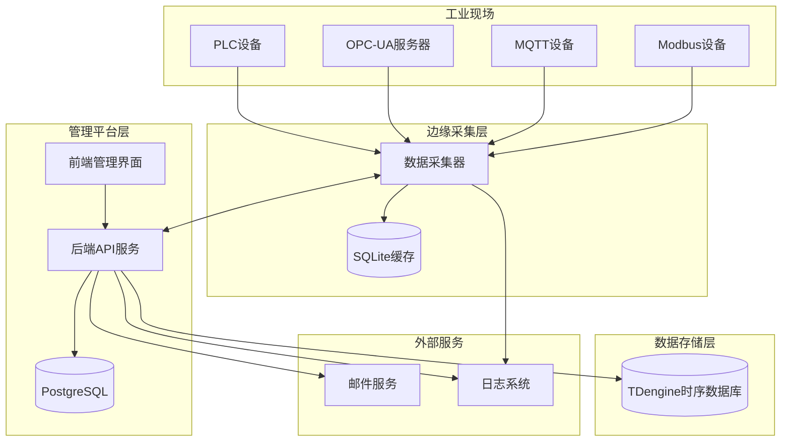
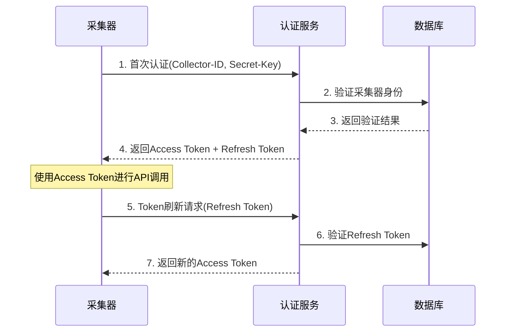

# 采集器与数据库管理平台集成功能设计文档

## 概述

本设计文档详细描述了ProDB项目中数据采集器与数据库管理平台之间的完整集成架构。该设计实现了高可靠性的工业数据采集、安全的设备管理、以及高性能的时序数据存储与查询功能。

## 架构设计

### 系统架构图



### 核心组件设计

#### 1. 数据采集器 (Collector)

**架构模式:** 插件化架构 + 事件驱动

**核心模块:**

```go
// 采集器主要组件结构
type Collector struct {
    ID           string
    Config       *CollectorConfig
    AuthManager  *AuthManager
    ProtocolMgr  *ProtocolManager
    DataBuffer   *DataBuffer
    StorageCache *StorageCache
    HeartbeatMgr *HeartbeatManager
    Logger       *Logger
}

type ProtocolManager struct {
    Protocols map[string]Protocol
    Tasks     map[string]*CollectionTask
}

type Protocol interface {
    Connect(config ProtocolConfig) error
    Collect(points []DataPoint) ([]DataValue, error)
    Disconnect() error
    IsConnected() bool
}
```

**协议插件设计:**

1. **Modbus协议插件**
   - 支持Modbus TCP和RTU
   - 自动重连机制
   - 批量读取优化
   - 数据类型转换

2. **OPC-UA协议插件**
   - 支持订阅和轮询模式
   - 证书管理
   - 节点浏览功能
   - 数据变化通知

3. **MQTT协议插件**
   - 支持QoS 0/1/2
   - 自动重连和会话恢复
   - Topic通配符支持
   - JSON数据解析

**存储转发机制:**

```sql
-- SQLite本地缓存表结构
CREATE TABLE data_cache (
    id INTEGER PRIMARY KEY AUTOINCREMENT,
    device_id TEXT NOT NULL,
    timestamp INTEGER NOT NULL,
    data_points TEXT NOT NULL, -- JSON格式
    retry_count INTEGER DEFAULT 0,
    created_at DATETIME DEFAULT CURRENT_TIMESTAMP,
    uploaded_at DATETIME NULL
);

CREATE INDEX idx_timestamp ON data_cache(timestamp);
CREATE INDEX idx_uploaded ON data_cache(uploaded_at);
```

#### 2. 认证与安全系统

**认证流程设计:**



**JWT Token结构:**

```json
{
  "header": {
    "alg": "HS256",
    "typ": "JWT"
  },
  "payload": {
    "collector_id": "uuid-string",
    "iat": 1640995200,
    "exp": 1640998800,
    "type": "access"
  }
}
```

**安全措施:**
- Secret-Key使用AES-256加密存储
- 通信使用TLS 1.3加密
- Token采用短期有效期 + 刷新机制
- 失败重试采用指数退避算法
- 异常行为检测和自动锁定

#### 3. 配置管理系统

**配置数据模型:**

```json
{
  "collector_config": {
    "collector_id": "uuid",
    "name": "工厂A-采集器1",
    "version": "1.0.0",
    "heartbeat_interval": 60,
    "data_buffer_size": 1000,
    "cache_retention_days": 7,
    "collection_tasks": [
      {
        "task_id": "task-001",
        "name": "PLC数据采集",
        "protocol": "modbus_tcp",
        "enabled": true,
        "schedule": {
          "interval": 5,
          "unit": "seconds"
        },
        "connection": {
          "host": "192.168.1.100",
          "port": 502,
          "slave_id": 1,
          "timeout": 3000
        },
        "data_points": [
          {
            "name": "temperature",
            "address": "40001",
            "data_type": "float32",
            "scale": 0.1,
            "unit": "°C"
          }
        ],
        "target": {
          "database": "industrial_data",
          "super_table": "modbus_metrics",
          "tags": {
            "location": "workshop_a",
            "device_type": "plc"
          }
        }
      }
    ]
  }
}
```

**配置下发机制:**
- 采集器启动时拉取完整配置
- 支持增量配置更新
- 配置版本管理和回滚
- 配置验证和错误处理

#### 4. TDengine集成设计

**数据库连接管理:**

```go
type TDengineManager struct {
    conn        *sql.DB
    config      *TDengineConfig
    connPool    *ConnectionPool
    queryCache  *QueryCache
    metrics     *DBMetrics
}

type TDengineConfig struct {
    Host         string `json:"host"`
    Port         int    `json:"port"`
    Username     string `json:"username"`
    Password     string `json:"password"`
    Database     string `json:"database"`
    MaxOpenConns int    `json:"max_open_conns"`
    MaxIdleConns int    `json:"max_idle_conns"`
    ConnTimeout  int    `json:"conn_timeout"`
}

type ConnectionPool struct {
    activeConns   int
    maxConns      int
    idleConns     chan *sql.DB
    connFactory   func() (*sql.DB, error)
}
```

**数据模型设计:**

```sql
-- 数据库初始化脚本
CREATE DATABASE IF NOT EXISTS industrial_data PRECISION 'ms';
USE industrial_data;

-- 超级表结构示例
CREATE STABLE IF NOT EXISTS modbus_metrics (
    ts TIMESTAMP,
    value DOUBLE,
    quality INT,
    data_type TINYINT,
    raw_value NCHAR(64)
) TAGS (
    collector_id NCHAR(64),
    device_id NCHAR(64),
    point_name NCHAR(128),
    location NCHAR(64),
    device_type NCHAR(32),
    unit NCHAR(16)
);

CREATE STABLE IF NOT EXISTS opcua_metrics (
    ts TIMESTAMP,
    value DOUBLE,
    status_code INT,
    source_timestamp TIMESTAMP,
    server_timestamp TIMESTAMP
) TAGS (
    collector_id NCHAR(64),
    server_uri NCHAR(256),
    node_id NCHAR(128),
    namespace_index INT,
    data_type NCHAR(32)
);

CREATE STABLE IF NOT EXISTS mqtt_metrics (
    ts TIMESTAMP,
    payload NCHAR(1024),
    qos TINYINT,
    retain BOOL
) TAGS (
    collector_id NCHAR(64),
    topic NCHAR(256),
    client_id NCHAR(64),
    message_type NCHAR(32)
);

-- 系统监控表
CREATE STABLE IF NOT EXISTS system_metrics (
    ts TIMESTAMP,
    cpu_usage DOUBLE,
    memory_usage DOUBLE,
    disk_usage DOUBLE,
    network_in DOUBLE,
    network_out DOUBLE
) TAGS (
    collector_id NCHAR(64),
    hostname NCHAR(128),
    os_type NCHAR(32)
);
```

**数据库操作服务层:**

```go
type TDengineService struct {
    manager *TDengineManager
    logger  *Logger
}

// 数据库管理操作
func (s *TDengineService) CreateDatabase(name string, options *DatabaseOptions) error
func (s *TDengineService) DropDatabase(name string) error
func (s *TDengineService) ListDatabases() ([]DatabaseInfo, error)
func (s *TDengineService) GetDatabaseInfo(name string) (*DatabaseInfo, error)

// 超级表管理操作
func (s *TDengineService) CreateSuperTable(name string, schema *SuperTableSchema) error
func (s *TDengineService) DropSuperTable(name string) error
func (s *TDengineService) ListSuperTables(database string) ([]SuperTableInfo, error)
func (s *TDengineService) GetSuperTableSchema(name string) (*SuperTableSchema, error)
func (s *TDengineService) AlterSuperTable(name string, alterSQL string) error

// 子表管理操作
func (s *TDengineService) CreateSubTable(name string, superTable string, tags map[string]interface{}) error
func (s *TDengineService) DropSubTable(name string) error
func (s *TDengineService) ListSubTables(superTable string) ([]SubTableInfo, error)

// 数据写入操作
func (s *TDengineService) InsertData(table string, data []DataPoint) error
func (s *TDengineService) BatchInsert(batches []BatchData) error
func (s *TDengineService) InsertWithAutoCreateTable(data []DataPoint) error

// 数据查询操作
func (s *TDengineService) Query(sql string, params ...interface{}) (*QueryResult, error)
func (s *TDengineService) QueryWithPagination(sql string, page, size int) (*PaginatedResult, error)
func (s *TDengineService) QueryLatestData(table string, tags map[string]string) (*QueryResult, error)
func (s *TDengineService) QueryTimeRange(table string, startTime, endTime time.Time, conditions map[string]interface{}) (*QueryResult, error)
func (s *TDengineService) QueryAggregation(table string, aggFunc string, interval string, conditions map[string]interface{}) (*QueryResult, error)

// 数据统计操作
func (s *TDengineService) GetDataCount(table string, conditions map[string]interface{}) (int64, error)
func (s *TDengineService) GetDataStatistics(table string, columns []string) (*StatisticsResult, error)
func (s *TDengineService) GetTimeRangeStatistics(table string, startTime, endTime time.Time) (*TimeRangeStats, error)
```

**数据写入策略:**
- 批量写入优化 (每批1000条记录)
- 异步写入避免阻塞采集
- 写入失败重试机制
- 数据压缩和去重
- 自动创建子表机制

**查询优化:**
- 基于时间分区的查询优化
- 标签索引优化
- 聚合查询缓存
- 分页查询支持
- 查询结果缓存机制

#### 5. 监控与告警系统

**监控指标设计:**

```go
type CollectorMetrics struct {
    // 基础指标
    Status           string    `json:"status"`
    LastHeartbeat    time.Time `json:"last_heartbeat"`
    Uptime          int64     `json:"uptime"`
    
    // 性能指标
    DataPointsPerSec float64   `json:"data_points_per_sec"`
    MemoryUsage     int64     `json:"memory_usage"`
    CPUUsage        float64   `json:"cpu_usage"`
    DiskUsage       int64     `json:"disk_usage"`
    
    // 连接指标
    ActiveConnections int       `json:"active_connections"`
    FailedConnections int       `json:"failed_connections"`
    
    // 数据质量指标
    SuccessfulReads  int64     `json:"successful_reads"`
    FailedReads      int64     `json:"failed_reads"`
    CachedDataCount  int64     `json:"cached_data_count"`
}
```

**告警规则引擎:**

```json
{
  "alert_rules": [
    {
      "id": "collector_offline",
      "name": "采集器离线告警",
      "condition": "last_heartbeat > 5m",
      "severity": "critical",
      "actions": ["email", "webhook"]
    },
    {
      "id": "high_error_rate",
      "name": "数据采集错误率过高",
      "condition": "failed_reads / (successful_reads + failed_reads) > 0.1",
      "severity": "warning",
      "actions": ["email"]
    }
  ]
}
```

## 组件接口设计

### API接口规范

#### 1. 采集器认证接口

```http
POST /api/v1/auth/collector/login
Content-Type: application/json

{
  "collector_id": "uuid-string",
  "secret_key": "encrypted-secret"
}

Response:
{
  "access_token": "jwt-token",
  "refresh_token": "jwt-token",
  "expires_in": 3600,
  "token_type": "Bearer"
}
```

#### 2. 配置获取接口

```http
GET /api/v1/collectors/{collector_id}/config
Authorization: Bearer {access_token}

Response:
{
  "version": "1.2.0",
  "config": { /* 配置JSON */ },
  "checksum": "md5-hash"
}
```

#### 3. 数据上报接口

```http
POST /api/v1/data/batch
Authorization: Bearer {access_token}
Content-Type: application/json

{
  "collector_id": "uuid",
  "timestamp": "2024-01-01T00:00:00Z",
  "data_points": [
    {
      "device_id": "device-001",
      "point_name": "temperature",
      "timestamp": "2024-01-01T00:00:00Z",
      "value": 25.6,
      "quality": 1,
      "tags": {
        "location": "workshop_a"
      }
    }
  ]
}
```

#### 4. 心跳接口

```http
POST /api/v1/collectors/{collector_id}/heartbeat
Authorization: Bearer {access_token}

{
  "timestamp": "2024-01-01T00:00:00Z",
  "status": "running",
  "metrics": { /* 监控指标 */ }
}
```

#### 5. TDengine数据库管理接口

**数据库管理接口:**

```http
# 获取数据库列表
GET /api/v1/tdengine/databases
Authorization: Bearer {access_token}

Response:
{
  "databases": [
    {
      "name": "industrial_data",
      "created_time": "2024-01-01T00:00:00Z",
      "ntables": 150,
      "vgroups": 4,
      "replica": 1,
      "quorum": 1,
      "days": 10,
      "keep": "365,365,365",
      "cache": 16,
      "blocks": 6,
      "minrows": 100,
      "maxrows": 4096,
      "wallevel": 1,
      "fsync": 3000,
      "comp": 2,
      "precision": "ms",
      "status": "ready"
    }
  ]
}

# 创建数据库
POST /api/v1/tdengine/databases
{
  "name": "new_database",
  "options": {
    "days": 10,
    "keep": 365,
    "cache": 16,
    "precision": "ms"
  }
}

# 删除数据库
DELETE /api/v1/tdengine/databases/{database_name}
```

**超级表管理接口:**

```http
# 获取超级表列表
GET /api/v1/tdengine/databases/{database}/supertables
Authorization: Bearer {access_token}

Response:
{
  "supertables": [
    {
      "name": "modbus_metrics",
      "created_time": "2024-01-01T00:00:00Z",
      "columns": [
        {"name": "ts", "type": "TIMESTAMP", "length": 8},
        {"name": "value", "type": "DOUBLE", "length": 8},
        {"name": "quality", "type": "INT", "length": 4}
      ],
      "tags": [
        {"name": "collector_id", "type": "NCHAR", "length": 64},
        {"name": "device_id", "type": "NCHAR", "length": 64}
      ],
      "subtable_count": 25
    }
  ]
}

# 创建超级表
POST /api/v1/tdengine/databases/{database}/supertables
{
  "name": "new_metrics",
  "columns": [
    {"name": "ts", "type": "TIMESTAMP"},
    {"name": "value", "type": "DOUBLE"},
    {"name": "status", "type": "INT"}
  ],
  "tags": [
    {"name": "device_id", "type": "NCHAR", "length": 64},
    {"name": "location", "type": "NCHAR", "length": 128}
  ]
}

# 获取超级表详细信息
GET /api/v1/tdengine/databases/{database}/supertables/{supertable}

# 修改超级表结构
PUT /api/v1/tdengine/databases/{database}/supertables/{supertable}
{
  "action": "add_column",
  "column": {"name": "new_field", "type": "FLOAT"}
}

# 删除超级表
DELETE /api/v1/tdengine/databases/{database}/supertables/{supertable}
```

**子表管理接口:**

```http
# 获取子表列表
GET /api/v1/tdengine/databases/{database}/supertables/{supertable}/subtables
Query Parameters:
- page: 页码 (默认1)
- size: 每页大小 (默认20)
- tag_filter: 标签过滤条件

Response:
{
  "subtables": [
    {
      "name": "d_collector_001_device_001",
      "supertable": "modbus_metrics",
      "created_time": "2024-01-01T00:00:00Z",
      "tags": {
        "collector_id": "collector-001",
        "device_id": "device-001",
        "location": "workshop_a"
      },
      "last_update": "2024-01-01T12:00:00Z"
    }
  ],
  "total": 150,
  "page": 1,
  "size": 20
}

# 创建子表
POST /api/v1/tdengine/databases/{database}/supertables/{supertable}/subtables
{
  "name": "d_new_device",
  "tags": {
    "collector_id": "collector-002",
    "device_id": "device-002",
    "location": "workshop_b"
  }
}

# 删除子表
DELETE /api/v1/tdengine/databases/{database}/subtables/{subtable}
```

**数据查询接口:**

```http
# 通用SQL查询
POST /api/v1/tdengine/query
{
  "sql": "SELECT * FROM modbus_metrics WHERE ts >= '2024-01-01 00:00:00' AND ts < '2024-01-02 00:00:00'",
  "database": "industrial_data"
}

# 结构化查询
POST /api/v1/tdengine/query/structured
{
  "database": "industrial_data",
  "table": "modbus_metrics",
  "columns": ["ts", "value", "quality"],
  "conditions": {
    "time_range": {
      "start": "2024-01-01T00:00:00Z",
      "end": "2024-01-02T00:00:00Z"
    },
    "tags": {
      "collector_id": "collector-001",
      "location": "workshop_a"
    },
    "filters": {
      "quality": {">=": 1}
    }
  },
  "order_by": "ts DESC",
  "limit": 1000
}

# 聚合查询
POST /api/v1/tdengine/query/aggregation
{
  "database": "industrial_data",
  "table": "modbus_metrics",
  "aggregations": [
    {"function": "avg", "column": "value", "alias": "avg_value"},
    {"function": "max", "column": "value", "alias": "max_value"},
    {"function": "count", "column": "*", "alias": "count"}
  ],
  "group_by": ["collector_id", "device_id"],
  "time_window": {
    "interval": "1h",
    "start": "2024-01-01T00:00:00Z",
    "end": "2024-01-02T00:00:00Z"
  },
  "conditions": {
    "tags": {"location": "workshop_a"}
  }
}

# 最新数据查询
GET /api/v1/tdengine/query/latest
Query Parameters:
- database: 数据库名
- table: 表名
- tags: 标签过滤条件 (JSON格式)
- columns: 要查询的列 (逗号分隔)

# 数据统计查询
GET /api/v1/tdengine/statistics/{database}/{table}
Query Parameters:
- start_time: 开始时间
- end_time: 结束时间
- group_by: 分组字段

Response:
{
  "total_records": 1000000,
  "time_range": {
    "start": "2024-01-01T00:00:00Z",
    "end": "2024-01-02T00:00:00Z"
  },
  "statistics": {
    "avg_value": 25.6,
    "max_value": 45.2,
    "min_value": 10.1,
    "std_dev": 5.8
  },
  "group_statistics": [
    {
      "group": {"collector_id": "collector-001"},
      "count": 50000,
      "avg_value": 26.1
    }
  ]
}
```

**数据写入接口:**

```http
# 批量数据写入
POST /api/v1/tdengine/data/batch
{
  "database": "industrial_data",
  "data": [
    {
      "table": "modbus_metrics",
      "supertable": "modbus_metrics",
      "tags": {
        "collector_id": "collector-001",
        "device_id": "device-001",
        "location": "workshop_a"
      },
      "records": [
        {
          "ts": "2024-01-01T00:00:00.000Z",
          "value": 25.6,
          "quality": 1
        },
        {
          "ts": "2024-01-01T00:00:05.000Z",
          "value": 25.8,
          "quality": 1
        }
      ]
    }
  ]
}

# 流式数据写入
POST /api/v1/tdengine/data/stream
Content-Type: application/x-ndjson

{"table":"modbus_metrics","tags":{"collector_id":"collector-001"},"ts":"2024-01-01T00:00:00Z","value":25.6}
{"table":"modbus_metrics","tags":{"collector_id":"collector-001"},"ts":"2024-01-01T00:00:05Z","value":25.8}
```

**数据库监控接口:**

```http
# 获取数据库性能指标
GET /api/v1/tdengine/monitoring/performance
Response:
{
  "connections": {
    "active": 15,
    "total": 100
  },
  "queries": {
    "queries_per_second": 150.5,
    "slow_queries": 2
  },
  "storage": {
    "total_size": "10.5GB",
    "data_size": "8.2GB",
    "index_size": "2.3GB"
  },
  "memory": {
    "used": "512MB",
    "cache_hit_rate": 0.95
  }
}

# 获取表空间使用情况
GET /api/v1/tdengine/monitoring/storage
Response:
{
  "databases": [
    {
      "name": "industrial_data",
      "size": "8.5GB",
      "tables": [
        {
          "name": "modbus_metrics",
          "type": "supertable",
          "size": "5.2GB",
          "record_count": 10000000
        }
      ]
    }
  ]
}
```

### 数据库接口设计

#### PostgreSQL数据模型

```sql
-- 采集器表
CREATE TABLE collectors (
    id UUID PRIMARY KEY DEFAULT gen_random_uuid(),
    name VARCHAR(100) NOT NULL,
    secret_key_hash VARCHAR(255) NOT NULL,
    status VARCHAR(20) DEFAULT 'offline',
    last_heartbeat TIMESTAMP,
    config_version VARCHAR(50),
    config_json JSONB,
    created_at TIMESTAMP DEFAULT CURRENT_TIMESTAMP,
    updated_at TIMESTAMP DEFAULT CURRENT_TIMESTAMP
);

-- 采集任务表
CREATE TABLE collection_tasks (
    id UUID PRIMARY KEY DEFAULT gen_random_uuid(),
    collector_id UUID REFERENCES collectors(id),
    name VARCHAR(100) NOT NULL,
    protocol VARCHAR(50) NOT NULL,
    config JSONB NOT NULL,
    enabled BOOLEAN DEFAULT true,
    created_at TIMESTAMP DEFAULT CURRENT_TIMESTAMP,
    updated_at TIMESTAMP DEFAULT CURRENT_TIMESTAMP
);

-- 配置模板表
CREATE TABLE config_templates (
    id UUID PRIMARY KEY DEFAULT gen_random_uuid(),
    name VARCHAR(100) NOT NULL,
    description TEXT,
    protocol VARCHAR(50) NOT NULL,
    template_config JSONB NOT NULL,
    version VARCHAR(20) DEFAULT '1.0.0',
    created_by UUID REFERENCES users(id),
    created_at TIMESTAMP DEFAULT CURRENT_TIMESTAMP
);

-- 告警规则表
CREATE TABLE alert_rules (
    id UUID PRIMARY KEY DEFAULT gen_random_uuid(),
    name VARCHAR(100) NOT NULL,
    condition TEXT NOT NULL,
    severity VARCHAR(20) NOT NULL,
    actions JSONB NOT NULL,
    enabled BOOLEAN DEFAULT true,
    created_at TIMESTAMP DEFAULT CURRENT_TIMESTAMP
);

-- 告警记录表
CREATE TABLE alerts (
    id UUID PRIMARY KEY DEFAULT gen_random_uuid(),
    rule_id UUID REFERENCES alert_rules(id),
    collector_id UUID REFERENCES collectors(id),
    level VARCHAR(20) NOT NULL,
    message TEXT NOT NULL,
    status VARCHAR(20) DEFAULT 'firing',
    fired_at TIMESTAMP DEFAULT CURRENT_TIMESTAMP,
    resolved_at TIMESTAMP
);
```

## 错误处理策略

### 1. 网络异常处理

```go
type RetryConfig struct {
    MaxRetries      int           `json:"max_retries"`
    InitialDelay    time.Duration `json:"initial_delay"`
    MaxDelay        time.Duration `json:"max_delay"`
    BackoffFactor   float64       `json:"backoff_factor"`
}

func (c *Collector) retryWithBackoff(operation func() error, config RetryConfig) error {
    var lastErr error
    delay := config.InitialDelay
    
    for i := 0; i <= config.MaxRetries; i++ {
        if err := operation(); err == nil {
            return nil
        } else {
            lastErr = err
            if i < config.MaxRetries {
                time.Sleep(delay)
                delay = time.Duration(float64(delay) * config.BackoffFactor)
                if delay > config.MaxDelay {
                    delay = config.MaxDelay
                }
            }
        }
    }
    return lastErr
}
```

### 2. 数据质量保证

```go
type DataValidator struct {
    Rules []ValidationRule
}

type ValidationRule interface {
    Validate(data DataPoint) error
}

type RangeValidator struct {
    Min, Max float64
}

func (r RangeValidator) Validate(data DataPoint) error {
    if value, ok := data.Value.(float64); ok {
        if value < r.Min || value > r.Max {
            return fmt.Errorf("value %f out of range [%f, %f]", value, r.Min, r.Max)
        }
    }
    return nil
}
```

### 3. 故障恢复机制

- **自动重连:** 协议连接断开时自动重连
- **配置回滚:** 配置更新失败时自动回滚到上一版本
- **数据恢复:** 系统重启后从本地缓存恢复未上传数据
- **服务降级:** 在资源不足时暂停非关键功能

## 测试策略

### 1. 单元测试

- 协议插件测试
- 数据验证测试
- 认证机制测试
- 存储转发测试

### 2. 集成测试

- 采集器与平台通信测试
- 数据库集成测试
- 告警系统测试
- 配置管理测试

### 3. 性能测试

- 高并发数据采集测试
- 大量采集器管理测试
- 数据库写入性能测试
- 网络异常恢复测试

### 4. 安全测试

- 认证安全测试
- 数据传输加密测试
- 权限控制测试
- 异常行为检测测试

## 部署架构

### 1. 开发环境

```yaml
# docker-compose.dev.yml
version: '3.8'
services:
  postgres:
    image: postgres:15
    environment:
      POSTGRES_DB: prodbmanager
      POSTGRES_USER: postgres
      POSTGRES_PASSWORD: password
    ports:
      - "5432:5432"
  
  tdengine:
    image: tdengine/tdengine:3.0.0.0
    ports:
      - "6030:6030"
      - "6041:6041"
    volumes:
      - tdengine_data:/var/lib/taos
  
  backend:
    build: ./platform/backend
    ports:
      - "8088:8088"
    depends_on:
      - postgres
      - tdengine
    environment:
      DB_HOST: postgres
      TDENGINE_HOST: tdengine
  
  frontend:
    build: ./platform/frontend
    ports:
      - "5173:5173"
    depends_on:
      - backend

volumes:
  tdengine_data:
```

### 2. 生产环境

- **负载均衡:** Nginx反向代理
- **数据库集群:** PostgreSQL主从复制
- **时序数据库:** TDengine集群部署
- **监控系统:** Prometheus + Grafana
- **日志系统:** ELK Stack
- **容器编排:** Kubernetes

## 性能优化

### 1. 数据采集优化

- 批量数据读取
- 异步数据处理
- 内存池复用
- 连接池管理

### 2. 数据存储优化

- 批量写入TDengine
- 数据压缩算法
- 分区表设计
- 索引优化

### 3. 网络通信优化

- HTTP/2协议支持
- 数据压缩传输
- 连接复用
- 请求合并

### 4. 系统资源优化

- 内存使用监控
- CPU使用优化
- 磁盘I/O优化
- 网络带宽管理