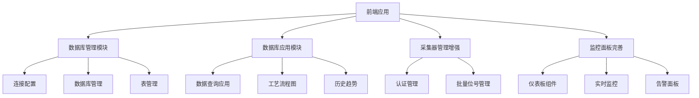

# 前端功能增强设计文档

## 概述

本设计文档详细描述了工业数据采集平台前端系统的功能增强方案。基于现有的React + TypeScript + Vite技术栈，我们将新增数据库管理、数据库应用、采集器认证完善等核心功能模块。设计遵循模块化、可扩展和用户友好的原则。

## 架构设计

### 技术栈
- **前端框架**: React 18 + TypeScript
- **构建工具**: Vite
- **路由**: TanStack Router
- **UI组件库**: 基于现有的组件系统（Lucide React图标）
- **状态管理**: React Hooks + Context API
- **HTTP客户端**: 基于现有的API服务层
- **后端API**: Go Gin框架，已有TDengine集成

### 整体架构



## 组件和接口设计

### 1. 侧边栏菜单结构重组

#### 新增菜单分组结构
**注意：保持现有菜单样式和布局不变，只在现有SidebarData结构基础上新增菜单分组**

```typescript
// 基于现有sidebar-data.ts结构，新增菜单分组
// 保持现有的SidebarData接口和样式不变

// 在现有navGroups数组中新增以下分组：
const newNavGroups = [
  // ... 保留现有的'数据采集'和'系统管理'分组 ...
  
  {
    title: '数据库管理', // 新增分组
    items: [
      {
        title: 'TDengine连接配置',
        url: '/database/connection',
        icon: Database,
      },
      {
        title: '数据库管理',
        url: '/database/management', 
        icon: Server,
      },
      {
        title: '表结构管理',
        url: '/database/tables',
        icon: Table2,
      },
    ],
  },
  {
    title: '数据库应用', // 新增分组
    items: [
      {
        title: '数据查询',
        url: '/database-apps/query',
        icon: Search,
      },
      {
        title: '工艺流程图', 
        url: '/database-apps/process-flow',
        icon: GitBranch,
      },
      {
        title: '历史趋势',
        url: '/database-apps/trends',
        icon: TrendingUp,
      },
    ],
  },
  
  // ... 保留现有的'系统设置'分组 ...
];
```

### 2. TDengine连接配置模块

#### 连接配置接口
```typescript
export interface TDengineConnection {
  id?: string;
  name: string;
  host: string;
  port: number;
  username: string;
  password: string;
  database?: string;
  timeout?: number;
  maxConnections?: number;
  isDefault?: boolean;
  status?: 'connected' | 'disconnected' | 'testing';
  lastConnected?: string;
  createdAt?: string;
  updatedAt?: string;
}

export interface ConnectionTestResult {
  success: boolean;
  message: string;
  latency?: number;
  serverVersion?: string;
  databases?: string[];
}
```

#### 连接配置组件
```typescript
// TDengineConnectionConfig.tsx
export const TDengineConnectionConfig: React.FC = () => {
  const [connections, setConnections] = useState<TDengineConnection[]>([]);
  const [selectedConnection, setSelectedConnection] = useState<TDengineConnection | null>(null);
  const [isEditing, setIsEditing] = useState(false);
  const [testResult, setTestResult] = useState<ConnectionTestResult | null>(null);

  // 连接测试功能
  const testConnection = async (connection: TDengineConnection) => {
    // 实现连接测试逻辑
  };

  // 保存连接配置
  const saveConnection = async (connection: TDengineConnection) => {
    // 实现保存逻辑
  };

  return (
    <div className="connection-config">
      <ConnectionList />
      <ConnectionForm />
      <ConnectionTest />
    </div>
  );
};
```

### 3. 数据库管理模块

#### 数据库管理接口
```typescript
export interface DatabaseInfo {
  name: string;
  created_time: string;
  ntables: number;
  vgroups: number;
  replica: number;
  quorum: number;
  days: number;
  keep: string;
  cache: number;
  blocks: number;
  minrows: number;
  maxrows: number;
  wallevel: number;
  fsync: number;
  comp: number;
  precision: string;
  status: string;
}

export interface SuperTableInfo {
  name: string;
  created_time: string;
  columns: TableColumn[];
  tags: TableTag[];
  subtables_count: number;
  data_size: string;
}

export interface TableColumn {
  name: string;
  type: string;
  length?: number;
  note?: string;
}

export interface TableTag {
  name: string;
  type: string;
  length?: number;
  note?: string;
}
```

#### 数据库管理组件
```typescript
// DatabaseManagement.tsx
export const DatabaseManagement: React.FC = () => {
  const [databases, setDatabases] = useState<DatabaseInfo[]>([]);
  const [selectedDatabase, setSelectedDatabase] = useState<string | null>(null);
  const [superTables, setSuperTables] = useState<SuperTableInfo[]>([]);

  return (
    <div className="database-management">
      <DatabaseList databases={databases} onSelect={setSelectedDatabase} />
      <DatabaseDetails database={selectedDatabase} />
      <SuperTableList tables={superTables} />
      <TableOperations />
    </div>
  );
};
```

### 4. 数据查询应用模块

#### 查询构建器接口
```typescript
export interface QueryBuilder {
  database: string;
  table: string;
  columns: ColumnSelection[];
  filters: FilterGroup[];
  groupBy: string[];
  orderBy: OrderByClause[];
  limit?: number;
  timeRange?: TimeRange;
}

export interface QueryResult {
  columns: string[];
  data: any[][];
  total?: number;
  executionTime?: number;
  cached?: boolean;
}

export interface SavedQuery {
  id: string;
  name: string;
  description?: string;
  query: QueryBuilder;
  createdAt: string;
  updatedAt: string;
  createdBy: string;
  isPublic: boolean;
  tags: string[];
}
```

#### 查询应用组件
```typescript
// DataQueryApp.tsx
export const DataQueryApp: React.FC = () => {
  const [queryBuilder, setQueryBuilder] = useState<QueryBuilder>();
  const [queryResult, setQueryResult] = useState<QueryResult | null>(null);
  const [savedQueries, setSavedQueries] = useState<SavedQuery[]>([]);

  return (
    <div className="data-query-app">
      <QueryBuilderPanel />
      <QueryResultPanel />
      <SavedQueriesPanel />
      <ExportPanel />
    </div>
  );
};
```

### 5. 工艺流程图模块

#### 流程图接口
```typescript
export interface ProcessFlowDiagram {
  id: string;
  name: string;
  description?: string;
  nodes: FlowNode[];
  connections: FlowConnection[];
  layout: FlowLayout;
  realTimeData: boolean;
  refreshInterval: number;
}

export interface FlowNode {
  id: string;
  type: 'device' | 'sensor' | 'valve' | 'pump' | 'tank' | 'pipe';
  position: { x: number; y: number };
  size: { width: number; height: number };
  label: string;
  dataSource?: {
    collectorId: string;
    deviceId: string;
    pointName: string;
  };
  currentValue?: any;
  status?: 'normal' | 'warning' | 'error' | 'offline';
  thresholds?: {
    warning: { min?: number; max?: number };
    error: { min?: number; max?: number };
  };
}

export interface FlowConnection {
  id: string;
  sourceId: string;
  targetId: string;
  type: 'pipe' | 'signal' | 'control';
  style?: {
    color: string;
    width: number;
    dashArray?: string;
  };
}
```

#### 流程图组件
```typescript
// ProcessFlowViewer.tsx
export const ProcessFlowViewer: React.FC = () => {
  const [diagram, setDiagram] = useState<ProcessFlowDiagram | null>(null);
  const [realTimeData, setRealTimeData] = useState<Map<string, any>>(new Map());
  const [isFullscreen, setIsFullscreen] = useState(false);

  return (
    <div className="process-flow-viewer">
      <FlowToolbar />
      <FlowCanvas />
      <NodeDetailsPanel />
      <RealTimeDataOverlay />
    </div>
  );
};
```

### 6. 历史趋势分析模块

#### 趋势分析接口
```typescript
export interface TrendAnalysis {
  id: string;
  name: string;
  parameters: TrendParameter[];
  timeRange: TimeRange;
  aggregation: AggregationConfig;
  chartConfig: ChartConfig;
  comparison?: ComparisonConfig;
}

export interface TrendParameter {
  id: string;
  name: string;
  collectorId: string;
  deviceId: string;
  pointName: string;
  unit?: string;
  color: string;
  yAxis: 'left' | 'right';
  visible: boolean;
}

export interface ComparisonConfig {
  enabled: boolean;
  type: 'period' | 'baseline';
  periodOffset?: string; // '1d', '1w', '1m', '1y'
  baselineStart?: string;
  baselineEnd?: string;
}
```

#### 趋势分析组件
```typescript
// HistoricalTrends.tsx
export const HistoricalTrends: React.FC = () => {
  const [trendAnalysis, setTrendAnalysis] = useState<TrendAnalysis>();
  const [chartData, setChartData] = useState<any[]>([]);
  const [isLoading, setIsLoading] = useState(false);

  return (
    <div className="historical-trends">
      <TrendConfigPanel />
      <TrendChart />
      <ParameterSelector />
      <ExportOptions />
    </div>
  );
};
```

### 7. 采集器认证增强模块

#### 认证管理接口
```typescript
export interface CollectorAuthStatus {
  id: string;
  collectorId: string;
  name: string;
  ipAddress: string;
  connectionTime: string;
  status: 'pending' | 'approved' | 'rejected' | 'expired';
  authToken?: string;
  expiresAt?: string;
  approvedBy?: string;
  approvedAt?: string;
  rejectedBy?: string;
  rejectedAt?: string;
  rejectionReason?: string;
  lastActivity?: string;
}

export interface AuthenticationRule {
  id: string;
  name: string;
  type: 'ip_whitelist' | 'certificate' | 'token' | 'manual';
  config: any;
  enabled: boolean;
  priority: number;
}
```

#### 认证管理组件
```typescript
// CollectorAuthentication.tsx
export const CollectorAuthentication: React.FC = () => {
  const [pendingCollectors, setPendingCollectors] = useState<CollectorAuthStatus[]>([]);
  const [authRules, setAuthRules] = useState<AuthenticationRule[]>([]);

  return (
    <div className="collector-authentication">
      <PendingAuthList />
      <AuthRulesManager />
      <AuthHistoryLog />
      <BulkAuthActions />
    </div>
  );
};
```

### 8. 批量位号管理模块

#### 批量管理接口
```typescript
export interface NodePoint {
  id: string;
  collectorId: string;
  deviceId: string;
  pointName: string;
  address: string;
  dataType: string;
  unit?: string;
  description?: string;
  enabled: boolean;
  scanRate: number;
  alarmConfig?: AlarmConfig;
  tags: Record<string, any>;
}

export interface BatchOperation {
  type: 'create' | 'update' | 'delete' | 'enable' | 'disable';
  nodePoints: NodePoint[];
  changes?: Partial<NodePoint>;
}

export interface ImportResult {
  success: boolean;
  totalRows: number;
  successCount: number;
  errorCount: number;
  errors: ImportError[];
  warnings: ImportWarning[];
}
```

#### 批量管理组件
```typescript
// BatchNodeManagement.tsx
export const BatchNodeManagement: React.FC = () => {
  const [nodePoints, setNodePoints] = useState<NodePoint[]>([]);
  const [selectedNodes, setSelectedNodes] = useState<string[]>([]);
  const [importResult, setImportResult] = useState<ImportResult | null>(null);

  return (
    <div className="batch-node-management">
      <BatchToolbar />
      <NodePointTable />
      <ImportExportPanel />
      <BulkEditDialog />
    </div>
  );
};
```

## 数据模型设计

### API接口设计

#### 数据库管理API
```typescript
// TDengine连接管理
POST   /api/database/connections          // 创建连接配置
GET    /api/database/connections          // 获取连接列表
PUT    /api/database/connections/:id      // 更新连接配置
DELETE /api/database/connections/:id      // 删除连接配置
POST   /api/database/connections/:id/test // 测试连接

// 数据库管理
GET    /api/database/databases            // 获取数据库列表
POST   /api/database/databases            // 创建数据库
GET    /api/database/databases/:name      // 获取数据库详情
DELETE /api/database/databases/:name      // 删除数据库

// 表管理
GET    /api/database/:db/supertables      // 获取超级表列表
POST   /api/database/:db/supertables      // 创建超级表
GET    /api/database/:db/supertables/:name // 获取超级表详情
DELETE /api/database/:db/supertables/:name // 删除超级表
```

#### 数据查询API
```typescript
// 数据查询
POST   /api/query/execute                 // 执行查询
POST   /api/query/structured              // 结构化查询
GET    /api/query/saved                   // 获取保存的查询
POST   /api/query/saved                   // 保存查询
DELETE /api/query/saved/:id               // 删除保存的查询

// 数据导出
POST   /api/export/data                   // 导出数据
GET    /api/export/status/:id             // 获取导出状态
```

#### 采集器认证API
```typescript
// 认证管理
GET    /api/collectors/auth/pending       // 获取待认证采集器
POST   /api/collectors/auth/approve       // 批准认证
POST   /api/collectors/auth/reject        // 拒绝认证
GET    /api/collectors/auth/rules         // 获取认证规则
POST   /api/collectors/auth/rules         // 创建认证规则
```

## 错误处理策略

### 前端错误处理
```typescript
export class APIError extends Error {
  constructor(
    public status: number,
    public code: string,
    message: string,
    public details?: any
  ) {
    super(message);
  }
}

export const errorHandler = {
  // 网络错误处理
  handleNetworkError: (error: Error) => {
    // 显示网络错误提示
  },
  
  // API错误处理
  handleAPIError: (error: APIError) => {
    switch (error.status) {
      case 401:
        // 处理认证错误
        break;
      case 403:
        // 处理权限错误
        break;
      case 500:
        // 处理服务器错误
        break;
      default:
        // 处理其他错误
    }
  },
  
  // 数据库连接错误处理
  handleDatabaseError: (error: any) => {
    // 处理数据库连接和查询错误
  }
};
```

### 后端错误处理
```go
// 统一错误响应格式
type ErrorResponse struct {
    Status  string `json:"status"`
    Code    string `json:"code"`
    Message string `json:"message"`
    Details any    `json:"details,omitempty"`
}

// 数据库连接错误处理
func handleDatabaseError(c *gin.Context, err error) {
    if strings.Contains(err.Error(), "connection refused") {
        c.JSON(http.StatusServiceUnavailable, ErrorResponse{
            Status:  "error",
            Code:    "DATABASE_UNAVAILABLE",
            Message: "数据库连接不可用",
            Details: err.Error(),
        })
        return
    }
    // 其他错误处理...
}
```

## 测试策略

### 单元测试
- 组件渲染测试
- API服务测试
- 工具函数测试
- 状态管理测试

### 集成测试
- 数据库连接测试
- API集成测试
- 用户交互流程测试

### 端到端测试
- 完整业务流程测试
- 跨模块功能测试
- 性能测试

## 性能优化

### 前端优化
- 组件懒加载
- 虚拟滚动（大数据表格）
- 查询结果缓存
- 图表渲染优化

### 后端优化
- 数据库连接池
- 查询结果缓存
- 分页查询
- 异步处理

## 安全考虑

### 数据安全
- 数据库连接信息加密存储
- API访问权限控制
- 敏感数据脱敏显示

### 认证安全
- 采集器证书验证
- 访问令牌管理
- 审计日志记录

这个设计文档提供了完整的技术架构和实现方案，确保新功能与现有系统的无缝集成。