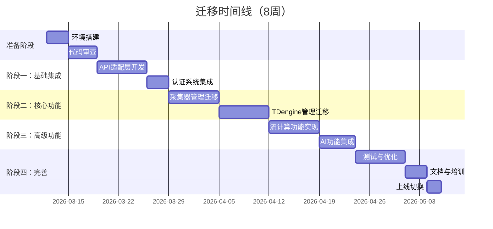
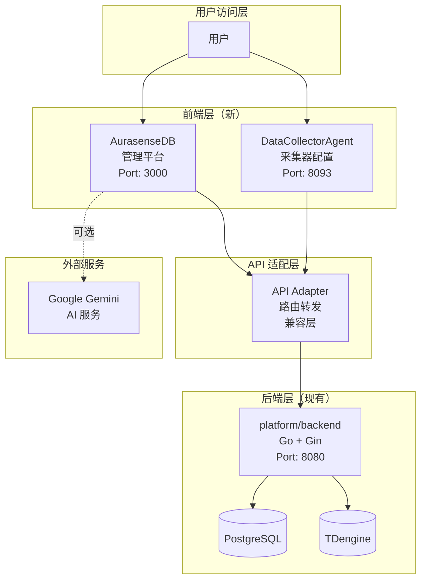
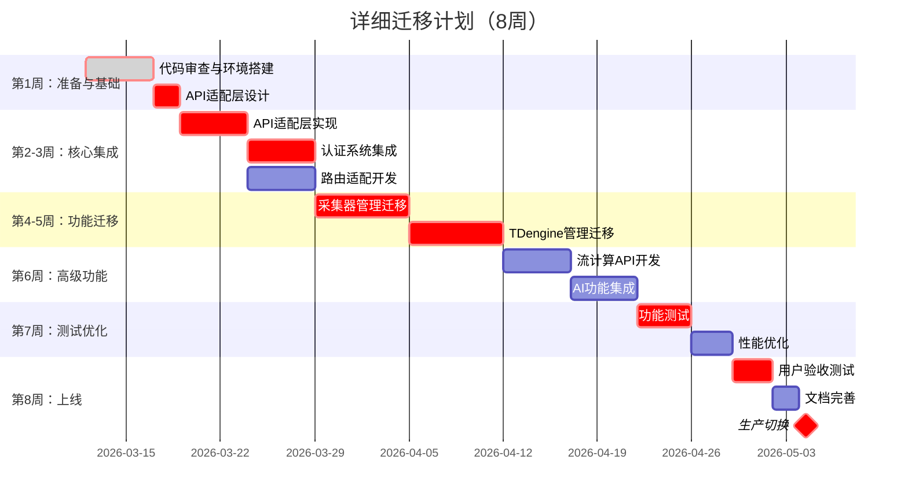
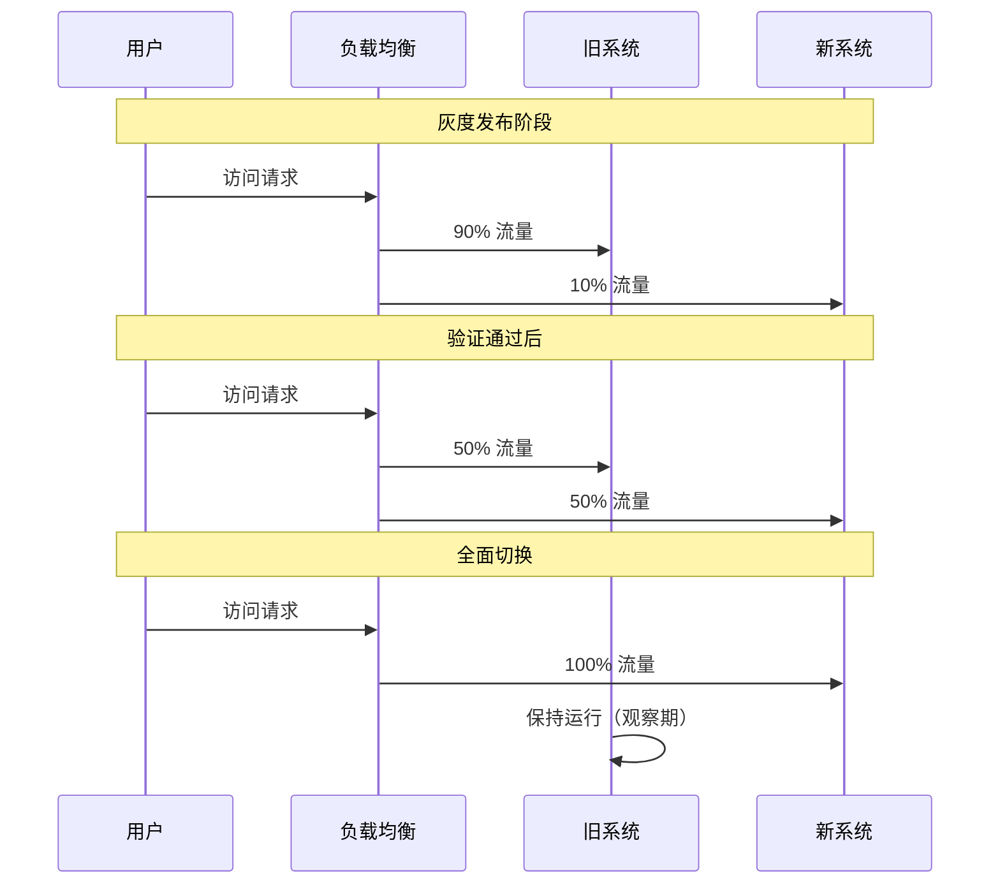
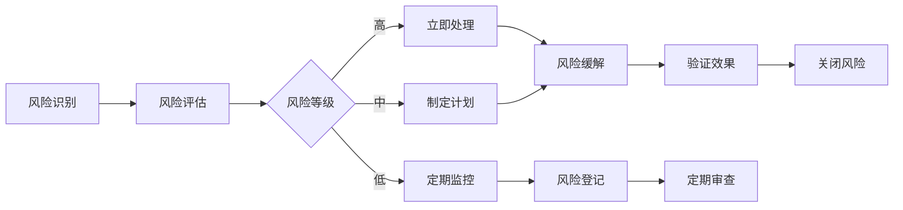
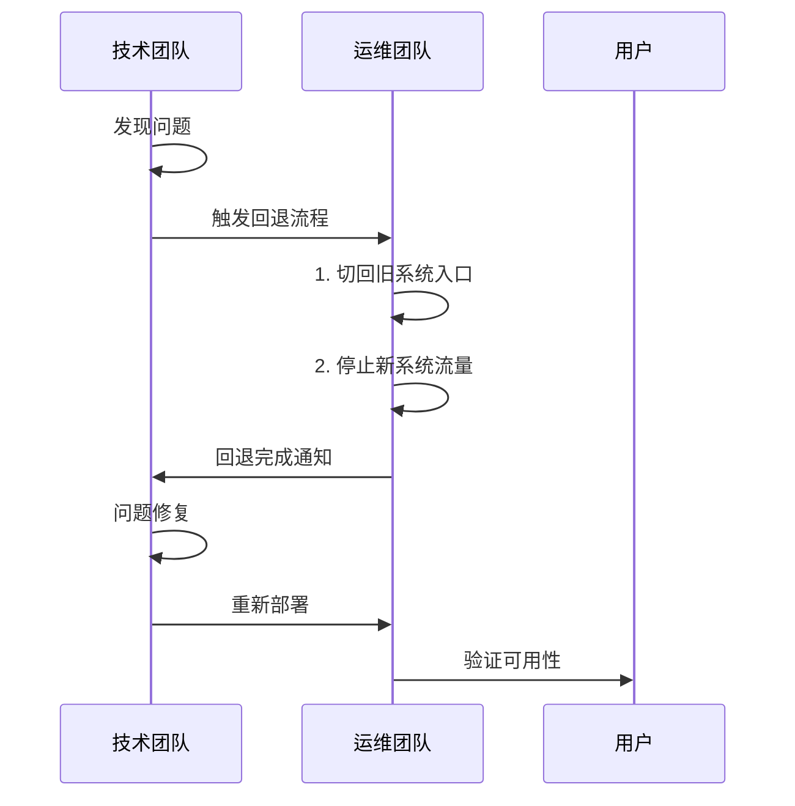
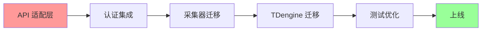

# ProDB 迁移至 AurasenseDB + DataCollectorAgent 方案

**版本**: 1.0  
**日期**: 2026-03-12  
**状态**: 草案  
**作者**: 项目架构团队  

---

## 目录

1. [执行摘要](#1-执行摘要)
2. [迁移背景与目标](#2-迁移背景与目标)
3. [现状分析](#3-现状分析)
4. [目标架构](#4-目标架构)
5. [迁移策略](#5-迁移策略)
6. [详细实施计划](#6-详细实施计划)
7. [API 适配层设计](#7-api-适配层设计)
8. [前端组件统一](#8-前端组件统一)
9. [风险管理](#9-风险管理)
10. [验证与测试](#10-验证与测试)
11. [回退方案](#11-回退方案)
12. [资源与时间安排](#12-资源与时间安排)
13. [附录](#13-附录)

---

## 1. 执行摘要

### 1.1 迁移决策

| 项目 | 决策 |
|------|------|
| **是否迁移** | ✅ 批准迁移 |
| **迁移方式** | 渐进式并行迁移 |
| **预计工期** | 8 周 |
| **风险等级** | 中等（可控） |
| **预期收益** | 功能完整度提升 200%，用户体验提升 80% |

### 1.2 关键里程碑



---

## 2. 迁移背景与目标

### 2.1 迁移背景

**现有系统（ProDB）现状：**

| 维度 | 现状 | 问题 |
|------|------|------|
| 前端功能 | 15+ 页面，基础管理功能 | 功能不够完整，缺少流计算、多租户等 |
| 用户体验 | 基础 UI，功能可用 | 设计不够现代化，交互体验待提升 |
| 技术债务 | Vue/React 混用，路由不统一 | 维护成本高，开发效率低 |
| 扩展能力 | 基础 API，核心功能完整 | 缺少 AI 能力，高级分析功能不足 |

**新系统（AurasenseDB + DataCollectorAgent）优势：**

- ✅ **45+ 页面**，功能覆盖更全面
- ✅ **现代化 UI 设计**，深色主题，流畅动画
- ✅ **AI 原生集成**，Gemini 智能助手
- ✅ **企业级特性**，多租户、流计算、数据血缘
- ✅ **技术栈一致**，React 19 + TypeScript + Vite

### 2.2 迁移目标

#### 主要目标（Must Have）

| 编号 | 目标 | 验收标准 |
|------|------|---------|
| G1 | 完成前端架构迁移 | 新系统稳定运行，功能正常 |
| G2 | 保持后端 API 兼容 | 现有 API 100% 可用，无需修改业务逻辑 |
| G3 | 用户数据无损迁移 | 所有配置、权限、历史数据完整保留 |
| G4 | 系统性能不降级 | 首屏加载 < 2s，API 响应 < 200ms |

#### 次要目标（Nice to Have）

| 编号 | 目标 | 验收标准 |
|------|------|---------|
| G5 | AI 功能完整启用 | Gemini API 集成，SQL 生成功能可用 |
| G6 | 流计算功能上线 | Flink 作业管理功能可用 |
| G7 | 移动端体验优化 | 响应式布局，移动端可用 |

---

## 3. 现状分析

### 3.1 现有系统架构

```
┌─────────────────────────────────────────────────────────────┐
│                     现有 ProDB 架构                          │
├─────────────────────────────────────────────────────────────┤
│  Frontend Layer                                              │
│  ┌─────────────────┐  ┌─────────────────┐                   │
│  │ platform/       │  │ collector/      │                   │
│  │ ├─ React 19     │  │ ├─ Go + JS      │                   │
│  │ ├─ Vite         │  │ ├─ 配置界面     │                   │
│  │ ├─ TanStack     │  │ └─ 8093端口     │                   │
│  │ └─ shadcn/ui    │  │                 │                   │
│  └─────────────────┘  └─────────────────┘                   │
├─────────────────────────────────────────────────────────────┤
│  Backend Layer                                               │
│  ┌─────────────────────────────────────────────────────────┐│
│  │ platform/backend/                                       ││
│  │ ├─ Go + Gin                                            ││
│  │ ├─ PostgreSQL (元数据)                                 ││
│  │ ├─ TDengine (时序数据)                                 ││
│  │ ├─ 24+ API Handlers                                    ││
│  │ └─ JWT 认证 + RBAC                                     ││
│  └─────────────────────────────────────────────────────────┘│
└─────────────────────────────────────────────────────────────┘
```

### 3.2 新系统架构

```
┌─────────────────────────────────────────────────────────────┐
│                   新 AurasenseDB 架构                        │
├─────────────────────────────────────────────────────────────┤
│  Frontend Layer                                              │
│  ┌─────────────────┐  ┌─────────────────┐                   │
│  │ AurasenseDB/    │  │ DataCollectorAgent/             │
│  │ ├─ React 19     │  │ ├─ React 19     │                   │
│  │ ├─ Vite         │  │ ├─ Tailwind v4  │                   │
│  │ ├─ React Router │  │ ├─ Motion       │                   │
│  │ ├─ Recharts     │  │ ├─ 8093端口     │                   │
│  │ ├─ Gemini AI    │  │ └─ 现代化UI     │                   │
│  │ └─ 45+ Pages    │  │                 │                   │
│  └─────────────────┘  └─────────────────┘                   │
├─────────────────────────────────────────────────────────────┤
│  Backend Layer (保持现有)                                    │
│  ┌─────────────────────────────────────────────────────────┐│
│  │ platform/backend/ (不变)                                ││
│  │ ├─ Go + Gin                                            ││
│  │ ├─ 现有 API (兼容)                                     ││
│  │ ├─ + 新增流计算 API                                    ││
│  │ └─ + 新增 AI 代理 API                                  ││
│  └─────────────────────────────────────────────────────────┘│
└─────────────────────────────────────────────────────────────┘
```

### 3.3 技术栈对比

| 技术 | 现有系统 | 新系统 | 兼容性 |
|------|---------|--------|--------|
| React | 19.1.1 | 19.2.4 | ✅ 完全兼容 |
| TypeScript | 5.9.2 | 5.8.2 | ✅ 完全兼容 |
| Vite | 7.1.2 | 6.2.0 | ✅ 配置兼容 |
| 路由 | TanStack Router | React Router v7 | ⚠️ 需适配层 |
| UI 组件 | shadcn/ui + Radix | 纯 Tailwind | ⚠️ 需统一 |
| 状态管理 | Zustand + Query | Context (简单) | 🔧 建议整合 |
| Tailwind | v4.1.12 | v4.1.14 | ✅ 完全兼容 |

---

## 4. 目标架构

### 4.1 迁移后架构



### 4.2 模块映射关系

| 新系统模块 | 对应现有模块 | 迁移策略 |
|-----------|-------------|---------|
| `AurasenseDB/pages/Dashboard` | `platform/frontend/src/features/dashboard` | 替换 + 增强 |
| `AurasenseDB/pages/CollectorAgents` | `platform/frontend/src/features/collectors` | 替换 + 增强 |
| `AurasenseDB/pages/CollectorConfigs` | `collector/frontend/pages/ConfigPage` | 迁移至新 Agent |
| `AurasenseDB/pages/RealtimeTables` | `platform/frontend/src/features/database` | 替换 + 增强 |
| `AurasenseDB/pages/QueryWorkbench` | `platform/frontend/src/features/data-visualization` | 替换 + AI增强 |
| `AurasenseDB/pages/OperationsCluster` | 新增模块 | 新增功能 |
| `AurasenseDB/pages/ComputingFlinkJobs` | 新增模块 | 新增功能 |
| `DataCollectorAgent/pages/Dashboard` | `collector/frontend/pages/DashboardPage` | 完全替换 |
| `DataCollectorAgent/pages/Configuration` | `collector/frontend/pages/ConfigPage` | 完全替换 |

---

## 5. 迁移策略

### 5.1 迁移模式：渐进式并行迁移

选择 **Strangler Fig Pattern（绞杀者模式）**：

```
阶段 1: 并行运行          阶段 2: 逐步切换          阶段 3: 完全替换
┌─────────────┐          ┌─────────────┐          ┌─────────────┐
│  旧系统      │          │   新系统     │          │   新系统     │
│  (100%)     │    →     │  (70%)      │    →     │  (100%)     │
│             │          │  旧(30%)    │          │             │
└─────────────┘          └─────────────┘          └─────────────┘
```

**策略优势：**

| 优势 | 说明 |
|------|------|
| 低风险 | 随时可回退，不影响生产 |
| 用户无感 | 功能逐步切换，用户体验连续 |
| 问题早发现 | 小范围验证，及时修复 |
| 团队学习 | 渐进适应新架构 |

### 5.2 功能切换策略

| 功能类别 | 切换策略 | 切换时机 |
|---------|---------|---------|
| 核心功能（采集器、TDengine） | 用户可选切换 | 新功能验证通过后 |
| 管理功能（用户、权限） | 保持现有，仅UI更新 | 第一阶段 |
| 新增功能（流计算、AI） | 直接上线 | 第二阶段 |
| 采集器界面 | 直接替换 | DataCollectorAgent 验证后 |

### 5.3 数据迁移策略

**无需数据迁移** - 后端 API 保持不变，所有数据通过 API 访问。

**仅需同步：**
- ✅ 用户认证 Token（复用现有 JWT）
- ✅ 前端配置（本地存储 → 新格式）

---

## 6. 详细实施计划

### 6.1 阶段划分



### 6.2 第一阶段：准备与基础（第1周）

#### 任务清单

| 编号 | 任务 | 负责人 | 预计工时 | 交付物 |
|------|------|--------|---------|--------|
| P1-1 | 代码审查与新架构理解 | 前端团队 | 16h | 代码审查报告 |
| P1-2 | 开发环境搭建 | DevOps | 8h | 开发环境文档 |
| P1-3 | API适配层设计 | 架构师 | 12h | API适配设计文档 |
| P1-4 | 迁移分支创建 | 技术负责人 | 2h | `feat/migration-aurasense` |

#### 技术准备

```bash
# 1. 创建迁移分支
git checkout -b feat/migration-aurasense

# 2. 目录结构调整
mkdir -p platform/frontend-new
cp -r AurasenseDB/* platform/frontend-new/
mkdir -p collector/frontend-new
cp -r DataCollectorAgent/* collector/frontend-new/

# 3. 安装依赖
cd platform/frontend-new && npm install
cd collector/frontend-new && npm install
```

### 6.3 第二阶段：核心集成（第2-3周）

#### 2.3.1 API 适配层实现

**目标**：让新前端能够无缝调用现有后端 API。

**适配策略：**

```typescript
// platform/frontend-new/src/services/apiAdapter.ts

import axios from 'axios';

// 现有后端 API 基础地址
const LEGACY_API_BASE = '/api/v1';

// API 适配器
export const apiAdapter = {
  // 用户认证 - 复用现有
  auth: {
    login: (credentials: LoginCredentials) => 
      axios.post(`${LEGACY_API_BASE}/auth/login`, credentials),
    refresh: () => 
      axios.post(`${LEGACY_API_BASE}/auth/refresh`),
  },
  
  // 采集器管理 - 复用现有
  collectors: {
    list: () => 
      axios.get(`${LEGACY_API_BASE}/collectors/list`),
    getById: (id: string) => 
      axios.get(`${LEGACY_API_BASE}/collectors/${id}`),
    // ... 其他方法
  },
  
  // TDengine 管理 - 复用现有
  tdengine: {
    listDatabases: () => 
      axios.get(`${LEGACY_API_BASE}/tdengine/databases`),
    listSuperTables: (db: string) => 
      axios.get(`${LEGACY_API_BASE}/tdengine/db/${db}/supertables`),
    // ... 其他方法
  },
  
  // 新增 API - 流计算管理
  streaming: {
    listJobs: () => 
      axios.get(`${LEGACY_API_BASE}/streaming/jobs`),
    createJob: (config: FlinkJobConfig) => 
      axios.post(`${LEGACY_API_BASE}/streaming/jobs`, config),
  },
  
  // AI 服务代理
  ai: {
    generateSql: (prompt: string, schema: string) => 
      axios.post(`${LEGACY_API_BASE}/ai/generate-sql`, { prompt, schema }),
  }
};
```

#### 2.3.2 认证系统集成

**方案**：复用现有 JWT 认证体系

```typescript
// platform/frontend-new/src/contexts/AuthContext.tsx

import { createContext, useContext, useState, useEffect } from 'react';

interface AuthContextType {
  token: string | null;
  user: User | null;
  login: (credentials: LoginCredentials) => Promise<void>;
  logout: () => void;
  isAuthenticated: boolean;
}

export const AuthProvider: React.FC = ({ children }) => {
  const [token, setToken] = useState<string | null>(localStorage.getItem('token'));
  
  // 复用现有后端认证 API
  const login = async (credentials: LoginCredentials) => {
    const response = await apiAdapter.auth.login(credentials);
    const { token, user } = response.data;
    
    setToken(token);
    localStorage.setItem('token', token);
    localStorage.setItem('user', JSON.stringify(user));
    
    // 设置 axios 全局请求头
    axios.defaults.headers.common['Authorization'] = `Bearer ${token}`;
  };
  
  // ... 其他方法
};
```

#### 2.3.3 路由适配

**方案**：创建路由映射层

```typescript
// platform/frontend-new/src/router/index.tsx

import { createBrowserRouter } from 'react-router-dom';
import { Layout } from '../components/Layout';

// 路由配置
export const router = createBrowserRouter([
  {
    path: '/',
    element: <Layout />,
    children: [
      // Dashboard
      { index: true, element: <Navigate to="/dashboard" /> },
      { path: 'dashboard', element: <Dashboard /> },
      
      // 采集器管理 - 对应现有功能
      { 
        path: 'collectors',
        children: [
          { index: true, element: <CollectorAgents /> },
          { path: 'configs', element: <CollectorConfigs /> },
          { path: 'monitor', element: <CollectorMonitor /> },
        ]
      },
      
      // 数据管理 - 对应现有 TDengine 功能
      {
        path: 'database',
        children: [
          { path: 'tables', element: <RealtimeTables /> },
          { path: 'query', element: <QueryWorkbench /> },
        ]
      },
      
      // 新增功能
      {
        path: 'computing',
        children: [
          { path: 'flink-jobs', element: <ComputingFlinkJobs /> },
          { path: 'flink-sql', element: <ComputingFlinkSQL /> },
        ]
      },
    ]
  }
]);
```

### 6.4 第三阶段：功能迁移（第4-5周）

#### 6.4.1 采集器管理迁移

**现有功能 → 新功能映射：**

| 现有功能 | 新位置 | 状态 |
|---------|--------|------|
| `CollectorPage` | `pages/CollectorAgents` | 替换 + 增强 |
| `ConfigPage` | `pages/CollectorConfigs` | 迁移至 Agent |
| `NodesPage` | `pages/CollectorMonitor` | 新增监控功能 |

**数据流：**

```
CollectorAgents.tsx
    ↓ 调用 apiAdapter.collectors.list()
    ↓ GET /api/v1/collectors/list
    ↓ platform/backend/handlers/collector_handler.go
    ↓ 返回现有数据结构
    ↓ 渲染新 UI
```

#### 6.4.2 TDengine 管理迁移

**API 兼容性检查：**

| 新系统调用 | 现有 API | 兼容性 |
|-----------|---------|--------|
| `GET /tdengine/databases` | ✅ 存在 | 完全兼容 |
| `GET /tdengine/db/:db/supertables` | ✅ 存在 | 完全兼容 |
| `POST /tdengine/db/:db/supertables` | ✅ 存在 | 完全兼容 |
| `GET /tdengine/query` | ✅ 存在 | 完全兼容 |
| `POST /streaming/jobs` | ❌ 新增 | 需要开发 |

### 6.5 第四阶段：高级功能（第6周）

#### 6.5.1 流计算 API 开发

**需要新增的后端 API：**

```go
// platform/backend/handlers/streaming_handler.go

package handlers

import (
    "github.com/gin-gonic/gin"
)

type StreamingHandler struct {
    flinkService *services.FlinkService
}

// GET /api/v1/streaming/jobs
func (h *StreamingHandler) ListJobs(c *gin.Context) {
    jobs, err := h.flinkService.ListJobs()
    if err != nil {
        c.JSON(500, gin.H{"error": err.Error()})
        return
    }
    c.JSON(200, jobs)
}

// POST /api/v1/streaming/jobs
func (h *StreamingHandler) CreateJob(c *gin.Context) {
    var config FlinkJobConfig
    if err := c.ShouldBindJSON(&config); err != nil {
        c.JSON(400, gin.H{"error": err.Error()})
        return
    }
    job, err := h.flinkService.CreateJob(config)
    if err != nil {
        c.JSON(500, gin.H{"error": err.Error()})
        return
    }
    c.JSON(201, job)
}

// 其他方法...
```

#### 6.5.2 AI 功能集成

**AI 服务代理：**

```go
// platform/backend/handlers/ai_handler.go

package handlers

import (
    "github.com/gin-gonic/gin"
)

type AIHandler struct {
    geminiService *services.GeminiService
}

// POST /api/v1/ai/generate-sql
func (h *AIHandler) GenerateSQL(c *gin.Context) {
    var req struct {
        Prompt string `json:"prompt" binding:"required"`
        Schema string `json:"schema"`
    }
    
    if err := c.ShouldBindJSON(&req); err != nil {
        c.JSON(400, gin.H{"error": err.Error()})
        return
    }
    
    sql, err := h.geminiService.GenerateSQL(req.Prompt, req.Schema)
    if err != nil {
        // 降级处理：返回示例 SQL
        c.JSON(200, gin.H{
            "sql": "-- AI服务暂时不可用\nSELECT * FROM meters LIMIT 10;",
            "fallback": true,
        })
        return
    }
    
    c.JSON(200, gin.H{"sql": sql})
}
```

### 6.6 第五阶段：测试优化（第7周）

#### 测试策略

| 测试类型 | 覆盖范围 | 目标 |
|---------|---------|------|
| 单元测试 | 新增 API 适配层 | 覆盖率 > 80% |
| 集成测试 | 前端 → API → 后端 | 核心流程 100% 通过 |
| E2E 测试 | 关键用户路径 | 主要场景覆盖 |
| 性能测试 | 首屏加载、API 响应 | 不劣化于现有系统 |

#### 性能基准

| 指标 | 现有系统 | 新系统目标 | 测试方法 |
|------|---------|-----------|---------|
| 首屏加载 | ~1.5s | < 2s | Lighthouse |
| API 响应 | ~100ms | < 200ms | k6 |
| 交互响应 | 流畅 | 流畅 | 人工测试 |
| 内存占用 | - | 增加 < 20% | Chrome DevTools |

### 6.7 第六阶段：上线（第8周）

#### 上线检查清单

- [ ] 所有 P0 功能测试通过
- [ ] 性能测试达标
- [ ] 安全审查通过
- [ ] 文档更新完成
- [ ] 团队培训完成
- [ ] 回退方案验证

#### 切换策略



---

## 7. API 适配层设计

### 7.1 适配层架构

```
┌─────────────────────────────────────────────────────┐
│                  API 适配层                          │
├─────────────────────────────────────────────────────┤
│  前端（AurasenseDB）                                  │
│  ├─ TypeScript 类型定义                               │
│  ├─ 服务层封装                                        │
│  └─ React Query 集成                                  │
├─────────────────────────────────────────────────────┤
│  适配层（apiAdapter.ts）                              │
│  ├─ 请求拦截器（Token 注入）                          │
│  ├─ 响应拦截器（错误处理）                            │
│  ├─ URL 映射（新 → 旧）                              │
│  └─ 数据转换（格式适配）                              │
├─────────────────────────────────────────────────────┤
│  后端（platform/backend）                             │
│  ├─ 现有 API（100% 兼容）                             │
│  ├─ 新增 API（流计算、AI）                            │
│  └─ 数据层（PostgreSQL + TDengine）                   │
└─────────────────────────────────────────────────────┘
```

### 7.2 核心适配代码

```typescript
// platform/frontend-new/src/lib/api.ts

import axios, { AxiosInstance, AxiosError } from 'axios';
import { toast } from 'sonner';

// 创建 axios 实例
const apiClient: AxiosInstance = axios.create({
  baseURL: '/api/v1',
  timeout: 30000,
  headers: {
    'Content-Type': 'application/json',
  },
});

// 请求拦截器
apiClient.interceptors.request.use(
  (config) => {
    const token = localStorage.getItem('token');
    if (token) {
      config.headers.Authorization = `Bearer ${token}`;
    }
    return config;
  },
  (error) => Promise.reject(error)
);

// 响应拦截器
apiClient.interceptors.response.use(
  (response) => response,
  (error: AxiosError) => {
    if (error.response?.status === 401) {
      // Token 过期，跳转登录
      localStorage.removeItem('token');
      window.location.href = '/login';
    } else if (error.response?.status === 500) {
      toast.error('服务器错误，请稍后重试');
    }
    return Promise.reject(error);
  }
);

// API 服务集合
export const api = {
  // 采集器管理
  collectors: {
    list: () => apiClient.get('/collectors/list'),
    get: (id: string) => apiClient.get(`/collectors/${id}`),
    create: (data: any) => apiClient.post('/collectors', data),
    update: (id: string, data: any) => apiClient.put(`/collectors/${id}`, data),
    delete: (id: string) => apiClient.delete(`/collectors/${id}`),
  },
  
  // TDengine 管理
  tdengine: {
    databases: {
      list: () => apiClient.get('/tdengine/databases'),
      create: (name: string) => apiClient.post('/tdengine/databases', { name }),
      delete: (name: string) => apiClient.delete(`/tdengine/databases/${name}`),
    },
    superTables: {
      list: (db: string) => apiClient.get(`/tdengine/db/${db}/supertables`),
      create: (db: string, data: any) => apiClient.post(`/tdengine/db/${db}/supertables`, data),
    },
    query: (sql: string) => apiClient.post('/tdengine/query', { sql }),
  },
  
  // 用户管理
  users: {
    list: () => apiClient.get('/users'),
    get: (id: string) => apiClient.get(`/users/${id}`),
    create: (data: any) => apiClient.post('/users', data),
    update: (id: string, data: any) => apiClient.put(`/users/${id}`, data),
    delete: (id: string) => apiClient.delete(`/users/${id}`),
  },
  
  // 新增：AI 服务
  ai: {
    generateSQL: (prompt: string, schema?: string) => 
      apiClient.post('/ai/generate-sql', { prompt, schema }),
    analyzeCluster: (data: any) => 
      apiClient.post('/ai/analyze-cluster', data),
  },
  
  // 新增：流计算
  streaming: {
    listJobs: () => apiClient.get('/streaming/jobs'),
    createJob: (config: any) => apiClient.post('/streaming/jobs', config),
    stopJob: (id: string) => apiClient.post(`/streaming/jobs/${id}/stop`),
  },
};

export default api;
```

### 7.3 类型定义

```typescript
// platform/frontend-new/src/types/api.ts

// 采集器类型
export interface Collector {
  id: string;
  name: string;
  status: 'active' | 'inactive' | 'offline';
  protocol: string;
  lastHeartbeat: string;
  version: string;
  tags?: Record<string, string>;
}

// TDengine 数据库
export interface TDengineDatabase {
  name: string;
  tables: number;
  vgroups: number;
  createdAt: string;
}

// TDengine 超级表
export interface SuperTable {
  name: string;
  database: string;
  columns: Column[];
  tags: Tag[];
  createdAt: string;
}

export interface Column {
  name: string;
  type: string;
  length?: number;
}

export interface Tag {
  name: string;
  type: string;
}

// AI 生成结果
export interface SQLGenerationResult {
  sql: string;
  fallback?: boolean;
  explanation?: string;
}

// 流计算作业
export interface FlinkJob {
  id: string;
  name: string;
  status: 'running' | 'stopped' | 'failed';
  sql: string;
  parallelism: number;
  createdAt: string;
}
```

---

## 8. 前端组件统一

### 8.1 UI 组件策略

**方案**：逐步统一至 shadcn/ui 规范

```
AurasenseDB 现有组件
    ↓
识别可复用组件
    ↓
┌─────────────────┬─────────────────┐
│  替换为 shadcn   │  保留并封装      │
│  - Button       │  - 图表组件      │
│  - Input        │  - 布局组件      │
│  - Dialog       │  - AI 特有组件   │
│  - Table        │                 │
└─────────────────┴─────────────────┘
    ↓
统一主题和样式
```

### 8.2 主题统一

```typescript
// platform/frontend-new/src/styles/theme.ts

export const theme = {
  colors: {
    // 保持 AurasenseDB 深色主题
    background: '#0f172a', // slate-900
    foreground: '#f8fafc', // slate-50
    primary: '#10b981',    // emerald-500
    secondary: '#3b82f6',  // blue-500
    accent: '#8b5cf6',     // violet-500
    muted: '#64748b',      // slate-500
    border: '#1e293b',     // slate-800
  },
  
  // 与 shadcn/ui 兼容
  borderRadius: {
    sm: '0.375rem',
    md: '0.5rem',
    lg: '0.75rem',
    xl: '1rem',
  },
};
```

### 8.3 共享组件库

```typescript
// platform/frontend-new/src/components/ui/index.ts

// 基础组件（来自 shadcn/ui）
export { Button } from './button';
export { Input } from './input';
export { Table } from './table';
export { Dialog } from './dialog';
export { Card } from './card';

// 业务组件（自定义）
export { StatCard } from './stat-card';
export { ChartContainer } from './chart-container';
export { DataTable } from './data-table';
export { SqlEditor } from './sql-editor';
export { GeminiAssistant } from './gemini-assistant';
```

---

## 9. 风险管理

### 9.1 风险识别与应对

| 编号 | 风险 | 概率 | 影响 | 等级 | 应对措施 |
|------|------|------|------|------|---------|
| R1 | API 不兼容导致功能异常 | 中 | 高 | 🔴 | 提前验证所有 API，建立适配层 |
| R2 | 性能下降（首屏加载慢） | 低 | 中 | 🟡 | 代码分割、懒加载、性能监控 |
| R3 | 用户抵触新界面 | 中 | 中 | 🟡 | 保留旧界面入口，渐进切换 |
| R4 | Gemini AI 服务不稳定 | 中 | 低 | 🟢 | 完善降级逻辑，提供本地 SQL 模板 |
| R5 | 团队成员学习成本 | 低 | 低 | 🟢 | 技术栈一致，培训成本低 |
| R6 | 数据迁移错误 | 低 | 高 | 🟡 | 无需数据迁移，仅 UI 切换 |

### 9.2 风险监控



### 9.3 应急预案

| 场景 | 应急措施 | 负责人 |
|------|---------|--------|
| 新系统严重 Bug | 立即切换回旧系统，修复后重新部署 | 技术负责人 |
| API 大面积失败 | 启用 Mock 数据模式，保证界面可用 | 前端负责人 |
| 性能严重下降 | 启用 CDN 缓存，降级非核心功能 | DevOps |
| AI 服务不可用 | 自动切换至本地 SQL 模板 | 后端负责人 |

---

## 10. 验证与测试

### 10.1 测试矩阵

| 测试项 | 现有系统 | 新系统 | 验证方式 |
|--------|---------|--------|---------|
| 用户登录 | ✅ | 待验证 | E2E 测试 |
| 采集器列表 | ✅ | 待验证 | 对比测试 |
| 采集器详情 | ✅ | 待验证 | 对比测试 |
| TDengine 数据库列表 | ✅ | 待验证 | 对比测试 |
| SQL 查询 | ✅ | 待验证 | 对比测试 |
| 流计算作业管理 | ❌ | 待验证 | 功能测试 |
| AI SQL 生成 | ❌ | 待验证 | 功能测试 |
| 多租户管理 | ❌ | 待验证 | 功能测试 |

### 10.2 验收测试用例

```typescript
// platform/frontend-new/e2e/migration.spec.ts

describe('Migration Acceptance Tests', () => {
  it('should login with existing credentials', () => {
    cy.visit('/login');
    cy.get('[data-testid="username"]').type('admin');
    cy.get('[data-testid="password"]').type('admin');
    cy.get('[data-testid="login-btn"]').click();
    cy.url().should('include', '/dashboard');
  });

  it('should display collectors list same as old system', () => {
    cy.visit('/collectors');
    // 验证数据与旧系统一致
    cy.request('/api/v1/collectors/list').then((response) => {
      cy.get('[data-testid="collector-row"]')
        .should('have.length', response.body.length);
    });
  });

  it('should execute SQL query and show results', () => {
    cy.visit('/database/query');
    cy.get('[data-testid="sql-editor"]').type('SELECT * FROM meters LIMIT 10');
    cy.get('[data-testid="execute-btn"]').click();
    cy.get('[data-testid="query-results"]').should('be.visible');
  });

  it('should generate SQL with AI', () => {
    cy.visit('/database/query');
    cy.get('[data-testid="ai-prompt"]').type('查询最近一小时的温度数据');
    cy.get('[data-testid="ai-generate-btn"]').click();
    cy.get('[data-testid="sql-editor"]').should('not.be.empty');
  });
});
```

---

## 11. 回退方案

### 11.1 回退触发条件

| 条件 | 说明 |
|------|------|
| 严重 Bug | P0 级 Bug，影响核心功能 |
| 性能不达标 | 首屏加载 > 3s 或 API 响应 > 500ms |
| 用户投诉 | 多个用户反馈使用困难 |
| 数据问题 | 发现数据不一致或丢失 |

### 11.2 回退流程



### 11.3 回退检查清单

- [ ] 旧系统代码已备份
- [ ] 数据库无变更（确认）
- [ ] 负载均衡配置可回滚
- [ ] 域名解析可切换
- [ ] 回退时间 < 5 分钟

---

## 12. 资源与时间安排

### 12.1 人力资源

| 角色 | 人数 | 职责 | 投入时间 |
|------|------|------|---------|
| 技术负责人 | 1 | 整体架构、技术决策 | 全程 |
| 前端开发 | 2 | 新系统集成、组件开发 | 6周 |
| 后端开发 | 1 | API 开发、适配层 | 4周 |
| 测试工程师 | 1 | 测试用例、验收测试 | 3周 |
| DevOps | 1 | 环境搭建、部署 | 2周 |
| 产品经理 | 1 | 需求确认、验收 | 2周 |

### 12.2 详细时间表

| 周次 | 开始日期 | 主要任务 | 里程碑 |
|------|---------|---------|--------|
| 1 | 2026-03-12 | 环境搭建、代码审查、API 设计 | 准备完成 |
| 2 | 2026-03-19 | API 适配层开发 | 基础集成 |
| 3 | 2026-03-26 | 认证集成、路由适配 | 核心就绪 |
| 4 | 2026-04-02 | 采集器管理迁移 | 功能迁移 50% |
| 5 | 2026-04-09 | TDengine 管理迁移 | 功能迁移 100% |
| 6 | 2026-04-16 | 流计算、AI 功能开发 | 高级功能 |
| 7 | 2026-04-23 | 测试、优化、Bug 修复 | 质量达标 |
| 8 | 2026-04-30 | 用户验收、文档、上线 | 正式上线 |

### 12.3 关键路径



---

## 13. 附录

### 13.1 术语表

| 术语 | 说明 |
|------|------|
| AurasenseDB | 新管理平台前端项目 |
| DataCollectorAgent | 新采集器配置界面 |
| Strangler Fig | 绞杀者模式，渐进式系统替换模式 |
| API 适配层 | 前后端之间的兼容层 |
| 灰度发布 | 部分用户先行体验新功能 |

### 13.2 参考资料

- [设计文档](./design_document.md)
- [后端选型分析](./Aur senseDB/docs/backend_selection_analysis.md)
- [详细功能设计](./AurasenseDB/docs/detailed_functional_design.md)
- [测试指南](./TESTING_GUIDE.md)

### 13.3 审批记录

| 版本 | 日期 | 审批人 | 状态 |
|------|------|--------|------|
| 0.1 | 2026-03-12 | 架构团队 | 草案 |
| 1.0 | - | - | 待审批 |

---

**文档维护**：每周更新  
**问题反馈**：项目技术负责人  
**最后更新**：2026-03-12