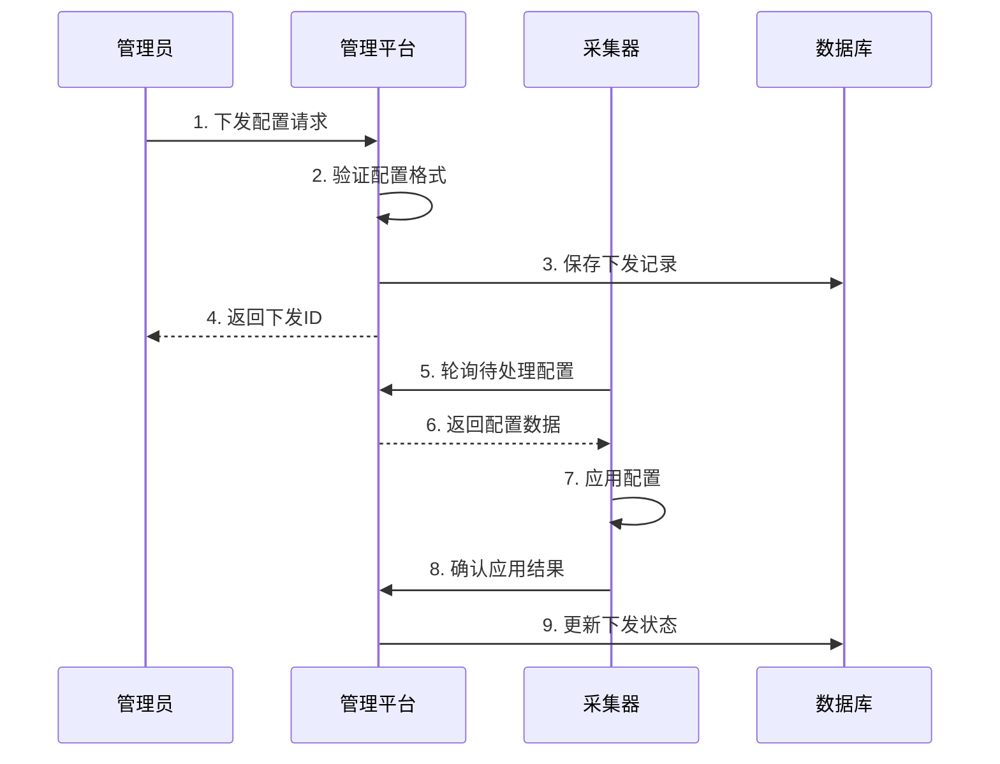

# 动态配置下发系统

本文档描述了ProDB平台中动态配置下发系统的实现，该系统支持配置的热更新、验证、应用确认和回滚功能。

## 概述

动态配置下发系统允许管理员远程向采集器推送配置更新，支持：

- 配置下发和热更新机制
- 配置验证、应用确认和回滚功能
- 离线配置同步和冲突处理
- 配置版本管理和历史记录
- 优先级管理和批量操作

## 系统架构

### 核心组件

1. **ConfigDeliveryService**: 配置下发业务逻辑
2. **ConfigDeliveryHandler**: REST API接口处理
3. **ConfigDelivery Model**: 配置下发记录
4. **ConfigVersion Model**: 配置版本历史

### 数据库模型

```sql
-- 配置下发记录表
CREATE TABLE config_deliveries (
    id UUID PRIMARY KEY,
    collector_id UUID NOT NULL,
    config JSONB NOT NULL,
    version VARCHAR(50) NOT NULL,
    status VARCHAR(20) DEFAULT 'pending',
    priority VARCHAR(10) DEFAULT 'normal',
    checksum VARCHAR(32) NOT NULL,
    delivered_at TIMESTAMP,
    applied_at TIMESTAMP,
    error_message TEXT,
    retries INTEGER DEFAULT 0,
    max_retries INTEGER DEFAULT 3,
    created_at TIMESTAMP,
    updated_at TIMESTAMP
);

-- 配置版本历史表
CREATE TABLE config_versions (
    id UUID PRIMARY KEY,
    collector_id UUID NOT NULL,
    version VARCHAR(50) NOT NULL,
    config JSONB NOT NULL,
    checksum VARCHAR(32) NOT NULL,
    is_active BOOLEAN DEFAULT false,
    created_at TIMESTAMP
);
```

## API接口

### 配置下发管理

| 方法 | 端点 | 描述 |
|------|------|------|
| POST | `/api/v1/config/deliver` | 下发配置到采集器 |
| POST | `/api/v1/config/validate` | 验证配置格式 |
| GET | `/api/v1/config/deliveries` | 列出配置下发记录 |
| GET | `/api/v1/config/deliveries/{id}` | 获取下发状态 |
| POST | `/api/v1/config/deliveries/{id}/confirm` | 确认配置应用结果 |

### 采集器配置管理

| 方法 | 端点 | 描述 |
|------|------|------|
| GET | `/api/v1/collectors/{id}/config/pending` | 获取待处理配置 |
| GET | `/api/v1/collectors/{id}/config/active` | 获取当前活动配置 |
| GET | `/api/v1/collectors/{id}/config/history` | 获取配置历史 |
| POST | `/api/v1/collectors/{id}/config/rollback` | 回滚到指定版本 |
| POST | `/api/v1/collectors/{id}/config/sync` | 同步离线配置 |
| POST | `/api/v1/collectors/{id}/config/resolve-conflicts` | 解决配置冲突 |

## 配置下发流程

### 1. 配置下发



### 2. 配置验证

配置在下发前会进行多层验证：

```go
// 基础验证
func (s *ConfigDeliveryService) ValidateConfiguration(config map[string]interface{}) error {
    // 检查配置不为空
    if config == nil {
        return fmt.Errorf("configuration cannot be empty")
    }

    // 验证心跳间隔
    if heartbeat, ok := config["heartbeat_interval"]; ok {
        if interval, ok := heartbeat.(float64); ok {
            if interval < 10 || interval > 3600 {
                return fmt.Errorf("heartbeat_interval must be between 10 and 3600 seconds")
            }
        }
    }

    // 验证缓冲区大小
    if bufferSize, ok := config["data_buffer_size"]; ok {
        if size, ok := bufferSize.(float64); ok {
            if size < 100 || size > 100000 {
                return fmt.Errorf("data_buffer_size must be between 100 and 100000")
            }
        }
    }

    // 验证采集任务
    if tasks, ok := config["collection_tasks"]; ok {
        if taskList, ok := tasks.([]interface{}); ok {
            for i, task := range taskList {
                if taskMap, ok := task.(map[string]interface{}); ok {
                    if err := s.validateCollectionTask(taskMap); err != nil {
                        return fmt.Errorf("invalid collection task %d: %w", i, err)
                    }
                }
            }
        }
    }

    return nil
}
```

### 3. 状态管理

配置下发支持以下状态：

- **pending**: 等待下发
- **delivered**: 已下发到采集器
- **applied**: 采集器已成功应用
- **failed**: 应用失败
- **cancelled**: 已取消
- **rolled_back**: 已回滚

### 4. 优先级管理

支持三种优先级：

- **high**: 高优先级（如紧急配置、回滚操作）
- **normal**: 普通优先级（默认）
- **low**: 低优先级

## 使用示例

### 下发配置

```bash
curl -X POST http://localhost:8088/api/v1/config/deliver \
  -H "Content-Type: application/json" \
  -d '{
    "collector_id": "collector-uuid",
    "config": {
      "heartbeat_interval": 60,
      "data_buffer_size": 1000,
      "collection_tasks": [
        {
          "name": "Temperature Monitoring",
          "protocol": "modbus_tcp",
          "config": {
            "host": "192.168.1.100",
            "port": 502,
            "slave_id": 1
          },
          "schedule": {
            "interval": 5,
            "unit": "seconds"
          }
        }
      ]
    },
    "version": "v1.2.0",
    "priority": "normal"
  }'
```

### 获取待处理配置

```bash
curl -X GET http://localhost:8088/api/v1/collectors/{collector_id}/config/pending
```

### 确认配置应用

```bash
curl -X POST http://localhost:8088/api/v1/config/deliveries/{delivery_id}/confirm \
  -H "Content-Type: application/json" \
  -d '{
    "success": true,
    "error_message": ""
  }'
```

### 回滚配置

```bash
curl -X POST http://localhost:8088/api/v1/collectors/{collector_id}/config/rollback \
  -H "Content-Type: application/json" \
  -d '{
    "target_version": "v1.1.0"
  }'
```

## 离线同步机制

当采集器重新上线时，系统会自动同步离线期间的配置：

```go
func (s *ConfigDeliveryService) SyncOfflineConfigurations(collectorID uuid.UUID) ([]ConfigDeliveryStatus, error) {
    // 获取所有待处理的配置
    var deliveries []models.ConfigDelivery
    err := s.db.Where("collector_id = ? AND status = ?", collectorID, "pending").Find(&deliveries).Error
    if err != nil {
        return nil, fmt.Errorf("failed to get pending configurations: %w", err)
    }

    // 标记为已下发
    var syncedConfigs []ConfigDeliveryStatus
    for _, delivery := range deliveries {
        delivery.Status = "delivered"
        now := time.Now()
        delivery.DeliveredAt = &now
        
        if err := s.db.Save(&delivery).Error; err != nil {
            continue
        }
        
        syncedConfigs = append(syncedConfigs, *s.convertToDeliveryStatus(&delivery))
    }

    return syncedConfigs, nil
}
```

## 冲突处理

当多个配置同时待处理时，系统会自动解决冲突：

```go
func (s *ConfigDeliveryService) ResolveConfigurationConflicts(collectorID uuid.UUID) error {
    // 获取所有待处理/已下发的配置
    var deliveries []models.ConfigDelivery
    err := s.db.Where("collector_id = ? AND status IN ?", 
        collectorID, []string{"pending", "delivered"}).
        Order("priority DESC, created_at ASC").
        Find(&deliveries).Error
    
    if err != nil {
        return fmt.Errorf("failed to get configurations: %w", err)
    }

    if len(deliveries) <= 1 {
        return nil // 无冲突
    }

    // 保留最高优先级的最新配置，取消其他配置
    for i := 1; i < len(deliveries); i++ {
        deliveries[i].Status = "cancelled"
        deliveries[i].ErrorMessage = "Superseded by higher priority configuration"
        s.db.Save(&deliveries[i])
    }

    return nil
}
```

## 版本管理

系统自动管理配置版本：

1. **版本生成**: 自动生成基于时间戳的版本号
2. **版本历史**: 保存所有配置版本的完整历史
3. **活动版本**: 标记当前生效的配置版本
4. **版本回滚**: 支持回滚到任意历史版本

### 版本命名规则

- 自动生成: `v{timestamp}` (如: v1640995200)
- 回滚版本: `{original_version}-rollback-{timestamp}`
- 手动指定: 支持语义化版本号 (如: v1.2.0)

## 错误处理

### 重试机制

配置应用失败时，系统会自动重试：

- 默认最大重试次数: 3次
- 重试间隔: 指数退避算法
- 超过重试次数后标记为失败

### 错误类型

1. **验证错误**: 配置格式不正确
2. **网络错误**: 采集器无法连接
3. **应用错误**: 采集器无法应用配置
4. **超时错误**: 配置应用超时

## 监控和告警

系统提供完整的监控功能：

- 配置下发成功率统计
- 配置应用延迟监控
- 失败配置告警通知
- 采集器配置状态监控

## 安全考虑

1. **配置验证**: 严格的配置格式验证
2. **权限控制**: 基于用户角色的配置下发权限
3. **审计日志**: 记录所有配置变更操作
4. **数据完整性**: 使用校验和确保配置完整性

## 性能优化

1. **批量操作**: 支持批量配置下发
2. **增量同步**: 只同步变更的配置
3. **压缩传输**: 大配置文件压缩传输
4. **缓存机制**: 缓存常用配置模板

## 测试

系统包含全面的测试覆盖：

```bash
# 运行配置下发服务测试
go test ./services -v -run TestConfigDeliveryService

# 运行所有测试
go test ./... -v
```

## 故障排查

### 常见问题

1. **配置下发失败**
   - 检查采集器网络连接
   - 验证配置格式
   - 查看错误日志

2. **配置应用超时**
   - 检查采集器性能
   - 调整超时设置
   - 简化配置内容

3. **版本冲突**
   - 使用冲突解决API
   - 检查配置优先级
   - 手动取消冲突配置

### 日志分析

系统提供详细的日志记录：

```bash
# 查看配置下发日志
grep "config delivery" /var/log/prodb/backend.log

# 查看配置应用日志
grep "config applied" /var/log/prodb/backend.log
```

## 未来增强

计划的功能改进：

1. **配置模板集成**: 与配置模板系统深度集成
2. **A/B测试**: 支持配置的A/B测试
3. **自动回滚**: 检测到异常时自动回滚
4. **配置预览**: 配置应用前的预览功能
5. **批量管理**: 更强大的批量配置管理
6. **实时推送**: WebSocket实时配置推送