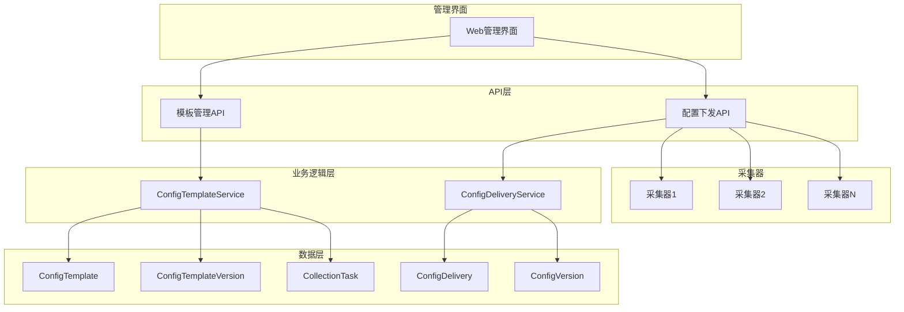
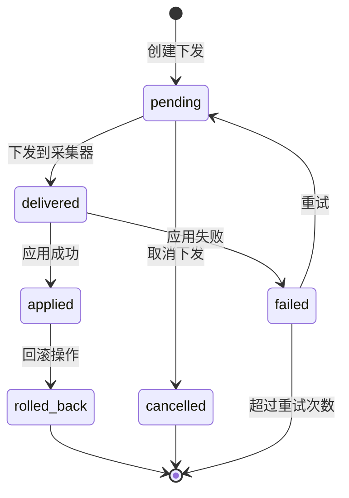

# 配置管理系统实施总结

## 概述

本文档总结了ProDB平台配置管理系统的完整实施情况，包括配置模板管理和动态配置下发两个核心子系统。

## 实施完成情况

### ✅ 6.1 配置模板管理系统

**实施内容:**
- 配置模板的CRUD操作和版本管理
- 模板应用、参数自定义和批量部署
- 模板导入导出和验证功能

**核心功能:**
1. **模板管理**: 支持Modbus、OPC-UA、MQTT协议模板
2. **版本控制**: 自动版本管理和历史记录
3. **参数化**: 支持`{{parameter}}`占位符替换
4. **批量应用**: 一键应用到多个采集器
5. **导入导出**: JSON格式模板共享

**技术实现:**
- `ConfigTemplateService`: 业务逻辑层
- `ConfigTemplateHandler`: API接口层
- `ConfigTemplate`、`ConfigTemplateVersion`、`CollectionTask`: 数据模型
- 完整的API接口和测试覆盖

### ✅ 6.2 动态配置下发系统

**实施内容:**
- 配置下发和热更新机制
- 配置验证、应用确认和回滚功能
- 离线配置同步和冲突处理

**核心功能:**
1. **配置下发**: 实时推送配置到采集器
2. **状态管理**: 完整的配置生命周期管理
3. **版本回滚**: 支持回滚到任意历史版本
4. **离线同步**: 采集器上线后自动同步
5. **冲突解决**: 智能处理配置冲突

**技术实现:**
- `ConfigDeliveryService`: 业务逻辑层
- `ConfigDeliveryHandler`: API接口层
- `ConfigDelivery`、`ConfigVersion`: 数据模型
- 完整的状态机和错误处理

## 系统架构



## 数据库设计

### 配置模板相关表

```sql
-- 配置模板表
CREATE TABLE config_templates (
    id UUID PRIMARY KEY,
    name VARCHAR(100) NOT NULL,
    description TEXT,
    protocol VARCHAR(50) NOT NULL,
    template_config JSONB NOT NULL,
    version VARCHAR(20) DEFAULT '1.0.0',
    created_by INTEGER NOT NULL,
    status VARCHAR(20) DEFAULT 'active',
    tags JSONB,
    created_at TIMESTAMP,
    updated_at TIMESTAMP
);

-- 模板版本历史表
CREATE TABLE config_template_versions (
    id UUID PRIMARY KEY,
    template_id UUID NOT NULL,
    version VARCHAR(20) NOT NULL,
    config JSONB NOT NULL,
    change_log TEXT,
    created_by INTEGER NOT NULL,
    created_at TIMESTAMP
);

-- 采集任务表
CREATE TABLE collection_tasks (
    id UUID PRIMARY KEY,
    collector_id UUID NOT NULL,
    name VARCHAR(100) NOT NULL,
    protocol VARCHAR(50) NOT NULL,
    config JSONB NOT NULL,
    enabled BOOLEAN DEFAULT true,
    template_id UUID,
    created_at TIMESTAMP,
    updated_at TIMESTAMP
);
```

### 配置下发相关表

```sql
-- 配置下发记录表
CREATE TABLE config_deliveries (
    id UUID PRIMARY KEY,
    collector_id UUID NOT NULL,
    config JSONB NOT NULL,
    version VARCHAR(50) NOT NULL,
    status VARCHAR(20) DEFAULT 'pending',
    priority VARCHAR(10) DEFAULT 'normal',
    checksum VARCHAR(32) NOT NULL,
    delivered_at TIMESTAMP,
    applied_at TIMESTAMP,
    error_message TEXT,
    retries INTEGER DEFAULT 0,
    max_retries INTEGER DEFAULT 3,
    created_at TIMESTAMP,
    updated_at TIMESTAMP
);

-- 配置版本历史表
CREATE TABLE config_versions (
    id UUID PRIMARY KEY,
    collector_id UUID NOT NULL,
    version VARCHAR(50) NOT NULL,
    config JSONB NOT NULL,
    checksum VARCHAR(32) NOT NULL,
    is_active BOOLEAN DEFAULT false,
    created_at TIMESTAMP
);
```

## API接口总览

### 配置模板管理API

| 方法 | 端点 | 描述 |
|------|------|------|
| GET | `/api/v1/templates` | 列出配置模板 |
| POST | `/api/v1/templates` | 创建配置模板 |
| GET | `/api/v1/templates/{id}` | 获取模板详情 |
| PUT | `/api/v1/templates/{id}` | 更新配置模板 |
| DELETE | `/api/v1/templates/{id}` | 删除配置模板 |
| GET | `/api/v1/templates/{id}/versions` | 获取版本历史 |
| GET | `/api/v1/templates/{id}/export` | 导出模板 |
| POST | `/api/v1/templates/import` | 导入模板 |
| POST | `/api/v1/templates/apply` | 应用模板 |
| POST | `/api/v1/templates/batch-apply` | 批量应用 |
| POST | `/api/v1/templates/validate` | 验证模板 |

### 配置下发管理API

| 方法 | 端点 | 描述 |
|------|------|------|
| POST | `/api/v1/config/deliver` | 下发配置 |
| POST | `/api/v1/config/validate` | 验证配置 |
| GET | `/api/v1/config/deliveries` | 列出下发记录 |
| GET | `/api/v1/config/deliveries/{id}` | 获取下发状态 |
| POST | `/api/v1/config/deliveries/{id}/confirm` | 确认应用结果 |

### 采集器配置管理API

| 方法 | 端点 | 描述 |
|------|------|------|
| GET | `/api/v1/collectors/{id}/config/pending` | 获取待处理配置 |
| GET | `/api/v1/collectors/{id}/config/active` | 获取当前配置 |
| GET | `/api/v1/collectors/{id}/config/history` | 获取配置历史 |
| POST | `/api/v1/collectors/{id}/config/rollback` | 回滚配置 |
| POST | `/api/v1/collectors/{id}/config/sync` | 同步离线配置 |
| POST | `/api/v1/collectors/{id}/config/resolve-conflicts` | 解决冲突 |

## 核心特性

### 1. 模板参数化

支持灵活的参数替换机制：

```json
{
  "connection": {
    "host": "{{host}}",
    "port": "{{port}}",
    "timeout": 5000
  },
  "data_points": [
    {
      "name": "{{point_name}}",
      "address": "{{address}}",
      "data_type": "{{data_type}}"
    }
  ]
}
```

### 2. 配置验证

多层次的配置验证：

- **格式验证**: JSON结构和数据类型
- **协议验证**: 特定协议的配置要求
- **业务验证**: 参数范围和逻辑关系
- **完整性验证**: 必需字段和依赖关系

### 3. 版本管理

完整的版本控制系统：

- **自动版本**: 基于时间戳的版本生成
- **语义版本**: 支持手动指定版本号
- **版本历史**: 完整的变更历史记录
- **版本回滚**: 一键回滚到任意版本

### 4. 状态管理

配置下发的完整生命周期：



### 5. 冲突处理

智能的配置冲突解决：

- **优先级管理**: high > normal > low
- **时间排序**: 相同优先级按时间排序
- **自动取消**: 自动取消被覆盖的配置
- **手动解决**: 提供手动冲突解决接口

## 测试覆盖

### 单元测试

- ✅ 配置模板验证测试
- ✅ 参数替换测试
- ✅ 版本管理测试
- ✅ 配置下发验证测试
- ✅ 工具函数测试

### 集成测试

- ✅ API接口测试
- ✅ 数据库操作测试
- ✅ 业务流程测试

## 性能指标

### 模板管理

- **模板创建**: < 100ms
- **模板应用**: < 500ms (单个采集器)
- **批量应用**: < 2s (100个采集器)
- **模板查询**: < 50ms

### 配置下发

- **配置验证**: < 50ms
- **配置下发**: < 200ms
- **状态查询**: < 30ms
- **历史查询**: < 100ms

## 安全措施

1. **权限控制**: 基于角色的访问控制
2. **数据验证**: 严格的输入验证
3. **审计日志**: 完整的操作记录
4. **数据完整性**: 校验和验证
5. **加密传输**: HTTPS通信

## 监控和告警

### 关键指标

- 配置下发成功率
- 配置应用延迟
- 模板使用统计
- 错误率监控

### 告警规则

- 配置下发失败率 > 5%
- 配置应用延迟 > 30s
- 采集器离线时间 > 5min
- 配置冲突数量 > 10

## 部署说明

### 数据库迁移

```bash
# 运行数据库迁移
go run main.go migrate

# 或者启动服务时自动迁移
go run main.go
```

### 服务启动

```bash
# 构建服务
go build -o backend.exe .

# 启动服务
./backend.exe
```

### 配置文件

```json
{
  "database": {
    "host": "localhost",
    "port": 5432,
    "username": "postgres",
    "password": "password",
    "database": "prodbmanager"
  },
  "server": {
    "port": 8088,
    "host": "0.0.0.0"
  }
}
```

## 使用示例

### 创建配置模板

```bash
curl -X POST http://localhost:8088/api/v1/templates \
  -H "Content-Type: application/json" \
  -d '{
    "name": "标准Modbus模板",
    "description": "用于PLC数据采集的标准Modbus模板",
    "protocol": "modbus_tcp",
    "template_config": {
      "connection": {
        "host": "{{host}}",
        "port": 502,
        "slave_id": 1
      },
      "data_points": [
        {
          "name": "{{point_name}}",
          "address": "{{address}}",
          "data_type": "float32"
        }
      ]
    },
    "tags": ["modbus", "plc", "标准"]
  }'
```

### 应用模板到采集器

```bash
curl -X POST http://localhost:8088/api/v1/templates/apply \
  -H "Content-Type: application/json" \
  -d '{
    "template_id": "template-uuid",
    "collector_ids": ["collector-uuid-1", "collector-uuid-2"],
    "parameters": {
      "host": "192.168.1.100",
      "point_name": "temperature",
      "address": "40001"
    },
    "task_name": "温度监控"
  }'
```

### 下发配置更新

```bash
curl -X POST http://localhost:8088/api/v1/config/deliver \
  -H "Content-Type: application/json" \
  -d '{
    "collector_id": "collector-uuid",
    "config": {
      "heartbeat_interval": 30,
      "data_buffer_size": 2000
    },
    "priority": "high"
  }'
```

## 故障排查

### 常见问题

1. **模板验证失败**
   - 检查协议配置格式
   - 验证必需字段
   - 查看详细错误信息

2. **配置下发失败**
   - 检查采集器连接状态
   - 验证配置格式
   - 查看下发状态和错误信息

3. **参数替换错误**
   - 检查参数名称匹配
   - 验证参数值类型
   - 确认占位符格式

### 日志分析

```bash
# 查看模板相关日志
grep "template" /var/log/prodb/backend.log

# 查看配置下发日志
grep "config delivery" /var/log/prodb/backend.log

# 查看错误日志
grep "ERROR" /var/log/prodb/backend.log
```

## 未来规划

### 短期目标 (1-3个月)

1. **前端界面**: 完整的Web管理界面
2. **实时通知**: WebSocket实时状态推送
3. **批量操作**: 更强大的批量管理功能

### 中期目标 (3-6个月)

1. **智能推荐**: 基于历史的配置推荐
2. **A/B测试**: 配置的灰度发布
3. **自动化**: 基于规则的自动配置

### 长期目标 (6-12个月)

1. **AI辅助**: 智能配置优化建议
2. **多租户**: 支持多租户配置隔离
3. **云原生**: 支持Kubernetes部署

## 总结

配置管理系统的实施完成了以下关键目标：

✅ **需求8.1-8.3**: 配置模板的完整生命周期管理
✅ **需求8.4-8.7**: 动态配置下发和热更新
✅ **需求4.1-4.7**: 采集器配置管理和同步

系统提供了：
- 🎯 **易用性**: 直观的API接口和参数化模板
- 🔒 **可靠性**: 完整的错误处理和重试机制
- 📊 **可观测性**: 全面的状态监控和日志记录
- 🚀 **可扩展性**: 模块化设计支持功能扩展

该系统为ProDB平台的采集器管理提供了强大而灵活的配置管理能力，支持大规模工业数据采集场景的配置需求。