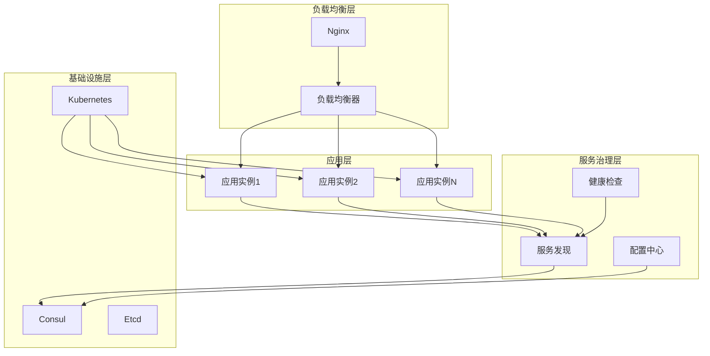

# 系统可扩展性支持实现文档

## 概述

本文档描述了ProDB项目中实现的系统可扩展性支持，包括水平扩展、负载均衡、服务发现、配置中心和容器化部署等功能，确保系统能够支持大规模部署和高可用性需求。

## 系统架构

### 核心组件

1. **ScalabilityManager** - 可扩展性管理器
2. **ServiceDiscovery** - 服务发现
3. **LoadBalancer** - 负载均衡器
4. **ConfigCenter** - 配置中心
5. **HealthChecker** - 健康检查器

### 架构图



## 功能特性

### 1. 服务发现

#### 支持的注册中心
- **Consul**: 生产级服务发现和配置管理
- **Etcd**: 分布式键值存储
- **Memory**: 内存注册表（开发测试用）

#### 服务注册
```go
service := &ServiceInfo{
    ID:      "backend-001",
    Name:    "prodb-backend",
    Address: "192.168.1.100",
    Port:    8088,
    Tags:    []string{"api", "backend"},
    Meta:    map[string]string{"version": "1.0.0"},
}

err := scalabilityManager.RegisterService(service)
```

#### 服务发现
```go
services, err := scalabilityManager.DiscoverServices("prodb-backend")
for _, service := range services {
    fmt.Printf("Service: %s at %s:%d\n", service.Name, service.Address, service.Port)
}
```

#### 健康检查
- TCP连接检查
- HTTP健康检查
- 自定义健康检查
- 心跳机制

### 2. 负载均衡

#### 支持的算法
- **轮询 (Round Robin)**: 依次分配请求
- **加权轮询 (Weighted Round Robin)**: 基于权重分配
- **最少连接 (Least Connections)**: 选择连接数最少的实例
- **IP哈希 (IP Hash)**: 基于客户端IP哈希

#### 使用示例
```go
// 获取服务实例
instance, err := scalabilityManager.GetServiceInstance("prodb-backend")
if err != nil {
    log.Fatal(err)
}

// 发起请求
url := fmt.Sprintf("http://%s:%d/api/v1/health", instance.Address, instance.Port)
resp, err := http.Get(url)
```

#### 健康检查集成
- 自动剔除不健康实例
- 实例恢复后自动加入
- 可配置的健康检查策略

### 3. 配置中心

#### 支持的提供者
- **Consul KV**: Consul键值存储
- **Etcd**: 分布式配置存储
- **Nacos**: 阿里云配置中心
- **Memory**: 内存配置（开发测试用）

#### 配置管理
```go
// 设置配置
err := scalabilityManager.SetConfig("database.max_connections", 100)

// 获取配置
maxConns := configCenter.GetConfigInt("database.max_connections", 50)

// 监听配置变化
err = configCenter.WatchConfig("database.max_connections", func(key string, value interface{}) {
    log.Printf("Config changed: %s = %v", key, value)
    // 重新配置数据库连接池
})
```

#### 配置热更新
- 实时配置变更通知
- 无需重启应用
- 配置版本管理
- 配置回滚支持

### 4. 自动扩展

#### 扩展策略
```go
config := &ScalingConfig{
    AutoScaling:       true,
    MinInstances:      2,
    MaxInstances:      10,
    CPUThreshold:      0.8,
    MemoryThreshold:   0.8,
    ScaleUpCooldown:   5 * time.Minute,
    ScaleDownCooldown: 10 * time.Minute,
}
```

#### 扩展触发条件
- CPU使用率超过阈值
- 内存使用率超过阈值
- 请求响应时间过长
- 错误率过高
- 自定义指标

#### 扩展操作
```go
// 手动扩容
err := scalabilityManager.ScaleUp("prodb-backend", 2)

// 手动缩容
err := scalabilityManager.ScaleDown("prodb-backend", 1)
```

### 5. 健康检查

#### 检查类型
- **TCP检查**: 检查端口连通性
- **HTTP检查**: 检查HTTP端点状态
- **gRPC检查**: 检查gRPC服务健康状态

#### 健康检查配置
```go
instance := &HealthCheckInstance{
    ID:            "backend-001",
    Name:          "prodb-backend",
    Address:       "192.168.1.100",
    Port:          8088,
    CheckType:     "http",
    CheckPath:     "/health",
    CheckInterval: 10 * time.Second,
    CheckTimeout:  5 * time.Second,
}

healthChecker.AddInstance(instance)
```

#### 健康状态管理
- 连续失败阈值
- 连续成功阈值
- 健康状态通知
- 实例元数据管理

## 容器化支持

### Docker部署

#### Dockerfile
```dockerfile
FROM golang:1.21-alpine AS builder
WORKDIR /app
COPY . .
RUN go build -o main .

FROM alpine:latest
RUN apk --no-cache add ca-certificates
WORKDIR /root/
COPY --from=builder /app/main .
EXPOSE 8088
CMD ["./main"]
```

#### Docker Compose
```yaml
version: '3.8'
services:
  prodb-backend:
    build: .
    ports:
      - "8088:8088"
    environment:
      - DB_HOST=postgres
      - CONSUL_HOST=consul
    depends_on:
      - postgres
      - consul
```

### Kubernetes部署

#### Deployment
```yaml
apiVersion: apps/v1
kind: Deployment
metadata:
  name: prodb-backend
spec:
  replicas: 3
  selector:
    matchLabels:
      app: prodb-backend
  template:
    spec:
      containers:
      - name: prodb-backend
        image: prodb/backend:latest
        ports:
        - containerPort: 8088
        resources:
          requests:
            memory: "256Mi"
            cpu: "250m"
          limits:
            memory: "512Mi"
            cpu: "500m"
```

#### Service
```yaml
apiVersion: v1
kind: Service
metadata:
  name: prodb-backend-service
spec:
  selector:
    app: prodb-backend
  ports:
  - port: 8088
    targetPort: 8088
```

#### HPA (水平Pod自动扩展)
```yaml
apiVersion: autoscaling/v2
kind: HorizontalPodAutoscaler
metadata:
  name: prodb-backend-hpa
spec:
  scaleTargetRef:
    apiVersion: apps/v1
    kind: Deployment
    name: prodb-backend
  minReplicas: 2
  maxReplicas: 10
  metrics:
  - type: Resource
    resource:
      name: cpu
      target:
        type: Utilization
        averageUtilization: 80
```

## API接口

### 服务管理接口

```http
# 注册服务
POST /api/v1/scalability/services/register
{
  "id": "backend-001",
  "name": "prodb-backend",
  "address": "192.168.1.100",
  "port": 8088,
  "tags": ["api", "backend"]
}

# 发现服务
GET /api/v1/scalability/services/prodb-backend/discover

# 获取服务实例（负载均衡）
GET /api/v1/scalability/services/prodb-backend/instance

# 更新健康状态
PUT /api/v1/scalability/services/backend-001/health
{
  "healthy": true
}

# 扩容服务
POST /api/v1/scalability/services/prodb-backend/scale-up
{
  "count": 2
}

# 缩容服务
POST /api/v1/scalability/services/prodb-backend/scale-down
{
  "count": 1
}
```

### 配置管理接口

```http
# 获取配置
GET /api/v1/scalability/config/database.max_connections

# 设置配置
PUT /api/v1/scalability/config/database.max_connections
{
  "value": 100
}

# 更新系统配置
PUT /api/v1/scalability/config
{
  "service_discovery": {
    "enabled": true,
    "registry": "consul"
  },
  "load_balancer": {
    "algorithm": "round_robin"
  }
}
```

### 监控接口

```http
# 获取可扩展性指标
GET /api/v1/scalability/metrics

# 获取负载均衡统计
GET /api/v1/scalability/load-balancer/stats

# 获取服务发现统计
GET /api/v1/scalability/service-discovery/stats
```

## 配置参数

### 完整配置示例

```yaml
scalability:
  service_discovery:
    enabled: true
    registry: "consul"
    address: "localhost:8500"
    namespace: "prodb"
    heartbeat_interval: "30s"
    ttl: "60s"
  
  load_balancer:
    enabled: true
    algorithm: "round_robin"
    health_check: true
    timeout: "30s"
  
  config_center:
    enabled: true
    provider: "consul"
    address: "localhost:8500"
    namespace: "prodb/config"
    watch_config: true
  
  health_check:
    enabled: true
    interval: "10s"
    timeout: "5s"
    failure_threshold: 3
    success_threshold: 2
  
  scaling:
    auto_scaling: true
    min_instances: 2
    max_instances: 10
    cpu_threshold: 0.8
    memory_threshold: 0.8
    scale_up_cooldown: "5m"
    scale_down_cooldown: "10m"
```

## 使用示例

### 基本使用

```go
package main

import (
    "context"
    "log"
    "platform/backend/services"
)

func main() {
    // 创建可扩展性管理器
    config := services.DefaultScalabilityConfig()
    manager := services.NewScalabilityManager(config)
    
    // 启动管理器
    ctx := context.Background()
    if err := manager.Start(ctx); err != nil {
        log.Fatal(err)
    }
    defer manager.Stop()
    
    // 注册当前服务
    service := &services.ServiceInfo{
        ID:      "backend-001",
        Name:    "prodb-backend",
        Address: "192.168.1.100",
        Port:    8088,
        Tags:    []string{"api", "backend"},
    }
    
    if err := manager.RegisterService(service); err != nil {
        log.Fatal(err)
    }
    
    // 设置配置
    manager.SetConfig("database.max_connections", 100)
    
    // 监听配置变化
    manager.WatchConfig("database.max_connections", func(key string, value interface{}) {
        log.Printf("Config changed: %s = %v", key, value)
    })
    
    // 启动HTTP服务器...
}
```

### 客户端使用

```go
// 服务发现客户端
type ServiceClient struct {
    manager *services.ScalabilityManager
}

func (c *ServiceClient) CallService(serviceName, path string) (*http.Response, error) {
    // 获取服务实例
    instance, err := c.manager.GetServiceInstance(serviceName)
    if err != nil {
        return nil, err
    }
    
    // 构建URL
    url := fmt.Sprintf("http://%s:%d%s", instance.Address, instance.Port, path)
    
    // 发起请求
    start := time.Now()
    resp, err := http.Get(url)
    latency := time.Since(start)
    
    // 记录请求结果（用于负载均衡统计）
    success := err == nil && resp.StatusCode < 400
    // 这里需要访问负载均衡器来记录统计信息
    
    return resp, err
}
```

## 监控和告警

### 关键指标

1. **服务实例指标**
   - 注册服务数量
   - 健康实例数量
   - 不健康实例数量

2. **负载均衡指标**
   - 请求总数
   - 成功请求数
   - 失败请求数
   - 平均响应时间

3. **配置中心指标**
   - 配置项数量
   - 配置更新频率
   - 配置监听错误数

4. **扩展指标**
   - 扩展操作次数
   - 当前实例数量
   - 资源使用率

### Prometheus监控

```yaml
# prometheus.yml
scrape_configs:
  - job_name: 'prodb-backend'
    static_configs:
      - targets: ['localhost:8088']
    metrics_path: '/metrics'
    scrape_interval: 15s
```

### Grafana仪表板

```json
{
  "dashboard": {
    "title": "ProDB Scalability Metrics",
    "panels": [
      {
        "title": "Service Instances",
        "type": "stat",
        "targets": [
          {
            "expr": "prodb_service_instances_total"
          }
        ]
      },
      {
        "title": "Load Balancer Requests",
        "type": "graph",
        "targets": [
          {
            "expr": "rate(prodb_lb_requests_total[5m])"
          }
        ]
      }
    ]
  }
}
```

## 最佳实践

### 1. 服务注册
- 使用有意义的服务名称
- 设置适当的标签和元数据
- 实现优雅的服务注销

### 2. 负载均衡
- 根据业务特点选择合适的算法
- 配置合理的健康检查
- 监控负载均衡效果

### 3. 配置管理
- 使用层次化的配置键
- 实现配置变更通知
- 提供配置回滚机制

### 4. 自动扩展
- 设置合理的扩展阈值
- 配置适当的冷却时间
- 监控扩展效果

### 5. 容器化部署
- 使用多阶段构建优化镜像大小
- 设置合理的资源限制
- 实现健康检查和就绪检查

## 故障排查

### 常见问题

1. **服务发现失败**
   ```bash
   # 检查注册中心状态
   curl http://localhost:8500/v1/agent/members
   
   # 检查服务注册状态
   curl http://localhost:8500/v1/catalog/services
   ```

2. **负载均衡不均匀**
   ```bash
   # 检查实例健康状态
   curl http://localhost:8088/api/v1/scalability/load-balancer/stats
   
   # 检查负载均衡算法配置
   curl http://localhost:8088/api/v1/scalability/metrics
   ```

3. **配置更新失败**
   ```bash
   # 检查配置中心连接
   curl http://localhost:8500/v1/kv/prodb/config/
   
   # 检查配置监听状态
   curl http://localhost:8088/api/v1/scalability/config-center/stats
   ```

4. **自动扩展异常**
   ```bash
   # 检查扩展指标
   kubectl get hpa
   
   # 检查Pod资源使用
   kubectl top pods
   ```

### 调试工具

- **服务发现调试**: Consul UI, Etcd客户端
- **负载均衡调试**: 负载均衡统计接口
- **配置中心调试**: 配置管理接口
- **容器调试**: kubectl, docker logs

## 扩展开发

### 添加新的负载均衡算法

```go
type CustomAlgorithm struct {
    // 自定义字段
}

func (ca *CustomAlgorithm) Select(instances []*ServiceInstance) *ServiceInstance {
    // 自定义选择逻辑
    return instances[0]
}

func (ca *CustomAlgorithm) UpdateStats(instance *ServiceInstance, latency time.Duration, success bool) {
    // 更新统计信息
}
```

### 添加新的配置提供者

```go
type CustomConfigProvider struct {
    // 自定义字段
}

func (ccp *CustomConfigProvider) Get(key string) (interface{}, error) {
    // 自定义获取逻辑
    return nil, nil
}

func (ccp *CustomConfigProvider) Set(key string, value interface{}) error {
    // 自定义设置逻辑
    return nil
}
```

## 总结

系统可扩展性支持通过服务发现、负载均衡、配置中心、健康检查和容器化部署等功能，为ProDB项目提供了完整的可扩展性解决方案：

1. **高可用性**: 通过服务发现和负载均衡确保服务高可用
2. **弹性扩展**: 支持水平扩展和自动扩展
3. **配置管理**: 集中化配置管理和热更新
4. **健康监控**: 全面的健康检查和监控
5. **容器化**: 完整的容器化部署支持

通过这些功能，系统能够支持大规模部署，处理高并发请求，并具备良好的可维护性和可扩展性。